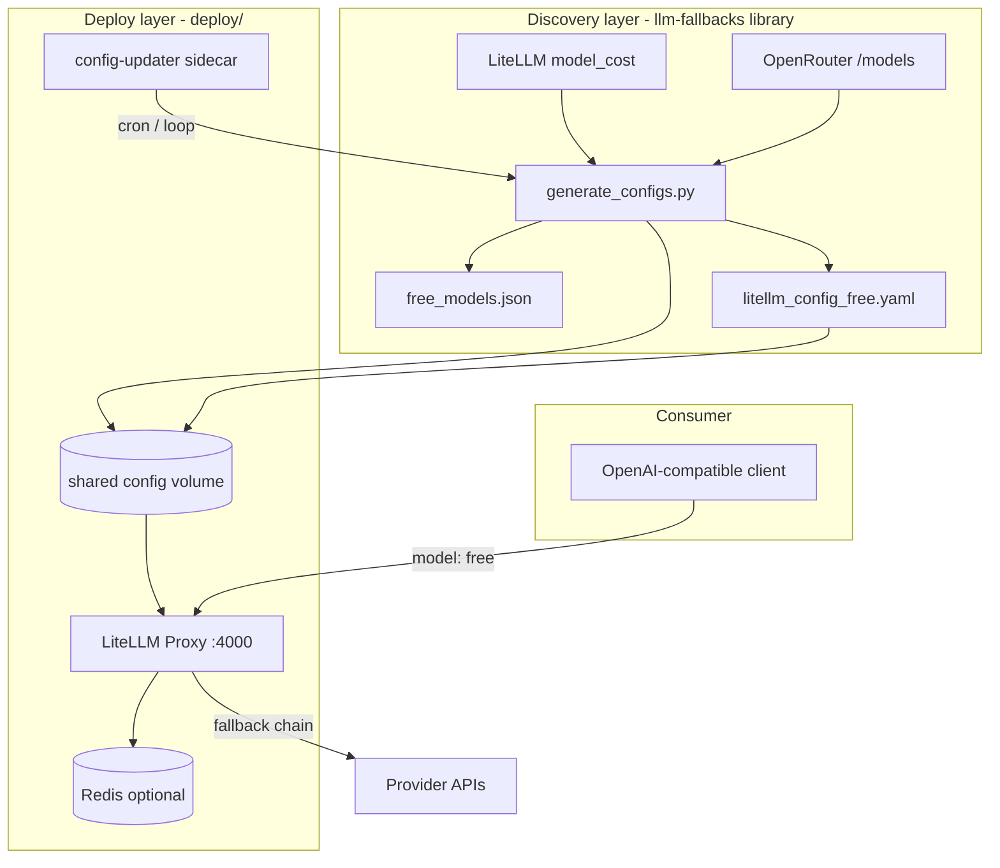
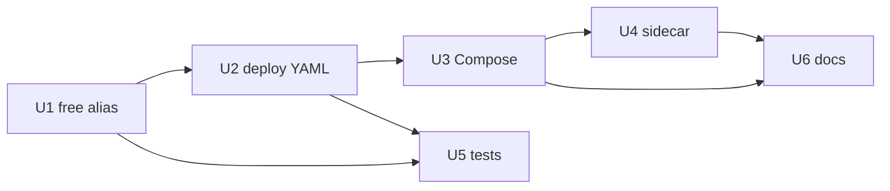

# feat: Self-hosted free-model AI gateway

## Summary

Extend `llm-fallbacks` to emit a deployable LiteLLM proxy configuration with a self-hosted `free` alias (ranked fallback chain over discovered free models), and add a thin `deploy/` Docker Compose stack (LiteLLM proxy + config-updater sidecar) that keeps the alias current without manual gateway administration.

## Problem Frame

Open-source AI gateways (Portkey, LLM Gateway, LiteLLM Proxy, etc.) unify provider APIs and handle retries/failbacks, but none ship a turnkey `openrouter/free`-style alias that **automatically discovers, ranks, and refreshes free models** without manual config. Community lists and static YAML go stale quickly.

This repository already implements the discovery/ranking brain: daily model ingestion from LiteLLM + OpenRouter, capability-based quality scoring, and generation of `configs/litellm_config_free.yaml`. What is missing is (1) a first-class **self-hosted `free` alias** independent of OpenRouter's router, (2) **deployment packaging** to run LiteLLM Proxy with live config refresh, and (3) **YAML templating** suitable for containerized environments.

The pasted strategy recommends building on an existing gateway with minimal glue — not forking a gateway or reimplementing failover logic. LiteLLM Proxy plus this repo's generated artifacts is the natural fit.

---

## Requirements

- R1. Consumers can call an OpenAI-compatible endpoint with model `free` and receive responses routed through a ranked chain of zero-cost chat models.
- R2. Among chat-capable models, the `free` alias fallback order matches `free_models.json` quality ranking (after priority pins such as `openrouter/free`), updated when configs regenerate.
- R3. `openrouter/free` remains a standalone callable model entry (OpenRouter passthrough unchanged). When building the `free` alias chain, `openrouter/free` may be prepended as the first hop if present.
- R4. A Docker Compose stack in-repo starts LiteLLM Proxy (port exposed, e.g. 4000) with minimal manual steps beyond supplying provider API keys.
- R5. A config-updater sidecar periodically runs `generate_configs` and signals the proxy to pick up refreshed YAML without manual intervention.
- R6. Generated LiteLLM YAML uses environment-variable placeholders for secrets and infrastructure endpoints (master key, Redis, Postgres) instead of random per-run values.
- R7. Library scope preserved: `llm-fallbacks` remains importable Python library; no HTTP server added to the package itself.
- R8. Config generation changes include automated tests; existing CI continues to pass with `OPENROUTER_API_KEY=dummy`.

---

## Key Technical Decisions

| ID | Decision | Rationale |
|----|----------|-----------|
| KTD1 | **LiteLLM Proxy** as gateway runtime | Repo already emits LiteLLM YAML; documented run path exists. Avoids forking Portkey/LLM Gateway and re-solving discovery. |
| KTD2 | **Self-hosted `free` alias via LiteLLM router fallbacks** | Add `model_name: free` whose primary target is the first chain member and whose `router_settings.fallbacks` lists remaining members (exclude primary). Chain = top-N chat-capable models from `build_free_models_list()` output, **intersected with generated `model_list` keys**, ranked by quality score. |
| KTD3 | **Keep `openrouter/free` passthrough entry** | Preserves current OpenRouter router as a direct callable model; optional first hop in the `free` chain complements rather than replaces the standalone entry. |
| KTD4 | **`deploy/` directory in this repo** | Version gateway topology alongside generated configs; discoverable without a separate repo. Respects AGENTS.md library boundary by isolating runtime from `src/`. |
| KTD5 | **Sidecar uses CLI subprocess, not import-time globals** | `config.py` has import-time network side effects. Sidecar runs `python -m llm_fallbacks.generate_configs` to avoid long-lived import state. |
| KTD6 | **Config delivery via shared volume + reload** | Sidecar writes to mounted volume; proxy reload via LiteLLM-supported mechanism (SIGHUP or documented reload endpoint). No admin API dependency in v1. |
| KTD7 | **Defer OpenModels API to v2** | OpenRouter `/models` + LiteLLM catalog already power discovery; OpenModels adds integration surface without blocking v1. |
| KTD8 | **Heuristic ranking only in v1** | Quality score remains capability-based (`heuristic_v1`); no latency/uptime probing until a metrics source exists. |

---

## High-Level Technical Design

**Request path for `model: free`:**

1. Client POST `/v1/chat/completions` with `"model": "free"`.
2. LiteLLM Proxy routes to the primary deployment for `free` (first chain member in `model_list`).
3. On rate limit, auth error, or timeout (per `router_settings.retry_policy`), proxy tries subsequent members listed in `router_settings.fallbacks` for `free` (primary excluded from fallback list).
4. Sidecar refreshes chain periodically from regenerated artifacts.

**Semantic note:** This is failure-driven fallback routing, not OpenRouter's per-request meta-router. Callers wanting OpenRouter's router should use `model: openrouter/free` directly (R3).

---

## Scope Boundaries

**In scope (v1)**

- `free` alias generation in `generate_configs.py`
- Deploy-safe YAML templating (env-based secrets/infra)
- `deploy/docker-compose.yml`, sidecar script, `deploy/README.md`
- Tests for new generation behavior
- README / AGENTS.md updates pointing to deploy path

**Out of scope (v1)**

- Forking or embedding Portkey, LLM Gateway, Kong, APISIX, Envoy AI Gateway
- OpenModels (`api.openmodels.run`) integration
- Runtime latency/uptime/throughput scoring
- Turning `llm-fallbacks` into a long-running HTTP service inside `src/`
- Multi-gateway abstraction layer
- Production hardening (TLS termination, auth beyond LiteLLM master key, observability stack)

### Deferred to Follow-Up Work

- OpenModels or alternate registry adapter in `config.py`
- LiteLLM admin API push instead of volume reload
- Separate `llm-fallbacks-gateway` repo if deploy grows beyond Compose
- Health-probe-driven dynamic reranking
- Portkey/LLM Gateway evaluation for teams needing their specific routing features

### Deferred for later (product identity)

- SaaS-hosted managed gateway offering
- Billing/cost-tracking dashboard

---

## System-Wide Impact

| Surface | Impact |
|---------|--------|
| `configs/litellm_config_free.yaml` | New `free` alias entries and possibly adjusted fallback structure; daily CI commit may produce larger diffs initially |
| `configs/free_models.json` | Unchanged schema; ordering continues to drive alias chain |
| CI (`python-package.yml`) | New tests; no workflow change required for deploy (deploy is manual/opt-in) |
| Public Python API (`__init__.py`) | No new exports required; generation stays internal |
| Environment variables | Deploy docs introduce `LITELLM_MASTER_KEY`, `REDIS_HOST`, `POSTGRES_*`, existing `OPENROUTER_API_KEY` |
| Downstream raw URL consumers | Unaffected; stable GitHub raw URLs for JSON/TXT artifacts remain |

---

## Risks and Dependencies

| Risk | Mitigation |
|------|------------|
| LiteLLM alias/router semantics differ from assumed fallback chain shape | Spike alias pattern in v1 U1 with manual `litellm --config` smoke test before Compose work |
| Import-time API calls break sidecar if env not set | Sidecar sets `OPENROUTER_API_KEY`; document `dummy` for offline/test |
| Generated YAML still too large for sidecar reload | Ship `litellm_config_free.yaml` only in deploy volume, not full 17k-line catalog |
| Random `master_key` today breaks reproducible deploy | U2 deploy-mode templating replaces UUID with env reference |
| Provider API key requirements vary by free model | Document required keys in `deploy/README.md`; alias skips models missing keys at runtime (LiteLLM behavior) |
| Test flakiness from live registry | Unit tests use inline fixtures; integration tests gate live assertions |

**Dependencies:** Docker, Docker Compose, LiteLLM proxy image or Python `litellm` CLI, optional Redis/Postgres per generated config.

---

## Implementation Units

### U1. Self-hosted `free` alias in config generation

**Goal:** Emit a LiteLLM-routable `free` model alias backed by a ranked fallback chain of top free chat models.

**Requirements:** R1, R2, R3

**Dependencies:** None

**Files:**

- `src/llm_fallbacks/generate_configs.py`
- `tests/test_generate.py`

**Approach:**

- Add helper (e.g. `build_free_alias_fallbacks()`) that:
  - Starts from `build_free_models_list()` quality ordering (not the per-model `FREE_MODELS` cost-sort loop).
  - Filters to chat-capable models: `mode == "chat"` **or** (`mode == ""` and model is present in generated `model_list` — OpenRouter metadata often omits mode).
  - Intersects with `model_list` `model_name` keys so every chain member is routable (use exact deployed names, not raw catalog IDs).
  - Takes top N (default **25**, matching existing chat fallback depth).
  - Prepends `openrouter/free` when present in `model_list`.
- Inject into `to_litellm_config_yaml()` when `free_only=True`:
  - `model_list` entry with `model_name: free` pointing at first chain member
  - `router_settings.fallbacks` entry `{free: [member2, member3, …]}` — **primary excluded**
- If chain is empty after filtering, omit `free` entry entirely (documented behavior).
- Spike in U1: validate with `litellm --config` before U3 Compose work.

**Patterns to follow:** Existing fallback construction loop in `to_litellm_config_yaml()` (lines 209–271); `build_free_models_list()` sorting in same file.

**Test scenarios:**

- Happy path: given fixture free models with mixed modes, alias chain contains only chat models in quality order.
- Edge case: empty chat-capable list → omit `free` entry; proxy returns model-not-found for `model: free`.
- Edge case: every alias member must exist in `model_list` (assert in test).
- Edge case: `openrouter/free` present → appears first in chain.
- Edge case: local provider models (`ollama/...`) never appear in alias chain.
- Integration: generated YAML parses and includes `model_name: free` key.

**Verification:** Unit tests pass; manual inspection of generated YAML shows `free` entry and ordered fallback list.

---

### U2. Deploy-safe YAML templating

**Goal:** Replace hardcoded localhost/random values in generated LiteLLM config with environment-driven placeholders suitable for Docker Compose.

**Requirements:** R6

**Dependencies:** U1

**Files:**

- `src/llm_fallbacks/generate_configs.py`
- `tests/test_generate.py`

**Approach:**

- Parameterize `to_litellm_config_yaml()` (or post-process YAML dict) for:
  - `general_settings.master_key` → `os.environ/LITELLM_MASTER_KEY` with documented default for local dev
  - `cache.host` / `cache.port` → env refs (`REDIS_HOST`, `REDIS_PORT`)
  - `general_settings.database_url` → env ref or optional disable path for minimal deploy
- Add `deploy_mode: bool` flag to generation (CLI `--deploy` or env `LLM_FALLBACKS_DEPLOY=1`) so committed `configs/` artifacts remain backward compatible for secrets/infra unless flag set. **U1 `free` alias is present in default output; U2 deploy placeholders are deploy-mode only.**
- In deploy mode: strip or no-op observability callbacks (otel, sentry, datadog) and make Postgres/Redis optional for minimal local deploy.
- Document which settings are required vs optional for minimal single-container deploy.

**Test scenarios:**

- Happy path: deploy mode emits env placeholders, no UUID master key.
- Happy path: default mode (no flag) preserves current artifact shape for existing consumers.
- Edge case: missing `POSTGRES_PASSWORD` env → YAML still valid with empty/default segment (matches current pattern).

**Verification:** Snapshot or structural test comparing keys in deploy vs default output.

---

### U3. Docker Compose stack

**Goal:** One-command local gateway deployment with LiteLLM Proxy and shared config volume.

**Requirements:** R1 (config prerequisite), R4, R7

**Dependencies:** U2

**Files:**

- `deploy/docker-compose.yml`
- `deploy/Dockerfile`
- `deploy/.env.example`
- `deploy/.gitignore` (`.env`, `runtime/`)
- `deploy/README.md`

**Approach:**

- Services:
  - `config-updater`: runs generation on startup **before** proxy accepts traffic; then periodic loop (6h)
  - `litellm`: official or `ghcr.io/berriai/litellm` image (pin digest at implement time), command `litellm --config /config/litellm_config_free.yaml`, mounts config volume read-only, exposes **`127.0.0.1:4000:4000`** by default
  - `redis`: optional, internal network only (no host port unless documented)
- `Dockerfile` with `context: ..`, mirroring daily workflow: `pip install -r requirements.txt && pip install -e .`
- Volume `./runtime/configs` (gitignored) holds generated YAML consumed by proxy.
- `.env.example` lists `OPENROUTER_API_KEY`, `LITELLM_MASTER_KEY` (required, no default in deploy), optional provider keys.
- Smoke tests require `Authorization: Bearer $LITELLM_MASTER_KEY` on inference routes.

**Patterns to follow:** Generated config assumptions in `to_litellm_config_yaml()` cache/database blocks.

**Test scenarios:**

- Test expectation: none — infrastructure scaffolding; manual smoke test documented in README.

**Verification:** `docker compose up` starts proxy; `curl localhost:4000/health/liveliness` (or equivalent) succeeds; README documents smoke curl for chat completion with `model: free`.

---

### U4. Config-updater sidecar script

**Goal:** Periodically regenerate configs and reload proxy without manual intervention.

**Requirements:** R1 (runtime endpoint), R5

**Dependencies:** U2, U3

**Files:**

- `deploy/scripts/update-config.sh` (or `.py`)
- `deploy/docker-compose.yml` (updater service command)

**Approach:**

- Loop or cron (e.g. every 6h + on startup):
  1. `python -m llm_fallbacks.generate_configs --output-dir /config --deploy` (env vars via Compose `environment`, not inline shell prefix)
  2. Atomic write (tmp + rename); validate YAML before swap; keep previous config on failure
  3. Signal proxy reload — **spike required before U3 ships:** prefer SIGHUP or documented reload API; v1 fallback `docker compose restart litellm` acceptable if spike fails (document downtime in R5/AE2)
- Sidecar subprocess avoids stale long-lived import state but **still performs per-run provider fetches** — set `OPENROUTER_API_KEY`, allow outbound network, or use `LITELLM_LOCAL_MODEL_COST_MAP=True` for offline regen.
- Log success/failure; alert on config age > N hours.

**Patterns to follow:** `.github/workflows/daily-config-update.yml` generation command.

**Test scenarios:**

- Happy path: script exits 0 when generation succeeds (can test in CI with tmpdir, no Docker).
- Error path: missing write permission → non-zero exit.

**Verification:** Sidecar container logs show periodic updates; proxy serves updated model list after refresh cycle.

---

### U5. Generation pipeline tests

**Goal:** Lock in alias and deploy-mode behavior to prevent regressions in the gateway contract.

**Requirements:** R8

**Dependencies:** U1, U2

**Files:**

- `tests/test_generate.py`
- optionally `tests/fixtures/expected_free_alias_snippet.yaml` (partial golden)

**Approach:**

- Extend class-based tests mirroring existing `TestBuildFreeModelsList` pattern.
- Add test invoking `to_litellm_config_yaml()` with fixture providers (mock or minimal dict inputs) — avoid full import of live `ALL_MODELS` where possible.
- Optional partial YAML golden for `free` alias structure only (not full 989-line file).

**Test scenarios:**

- Covers R1/R2: alias chain order matches quality sort.
- Covers R6: deploy mode placeholder keys present.
- Regression: default output includes `free` alias (U1); deploy-mode delta isolated to secrets/infra/observability keys; JSON artifact schemas unchanged.

**Verification:** `OPENROUTER_API_KEY=dummy pytest tests/test_generate.py -v` passes in CI.

---

### U6. Documentation and agent guidance

**Goal:** Make deploy path discoverable for humans and AI agents.

**Requirements:** R4 (discoverability)

**Dependencies:** U3, U4

**Files:**

- `deploy/README.md`
- `README.md` (new "Self-Hosted Gateway" section)
- `AGENTS.md` (note `deploy/` scope exception to library-only rule)
- `configs/README.md` (link to deploy; distinguish library artifact vs deploy-ready YAML)

**Approach:**

- Document quick start: copy `.env.example`, `docker compose up`, example curl **with Authorization header**.
- Title stack as **local development** — production requires TLS, firewall, secret management (follow-up).
- Clarify relationship: library generates brain, deploy runs gateway.
- Clarify `free` vs `openrouter/free`: failure-driven ranked chain vs OpenRouter meta-router.
- List required vs optional API keys; document prompt data crosses operator network to third-party providers.
- Note v1 limitations (heuristic ranking, no OpenModels).

**Test scenarios:**

- Test expectation: none — documentation only.

**Verification:** New developer can follow README without reading source.

---

## Open Questions

| Question | Status | Owner |
|----------|--------|-------|
| Exact LiteLLM hot-reload mechanism for mounted config | **Block U3/U4 on spike** — pass/fail: config visible via `/v1/models` without restart | Implementer |
| Top-N size for `free` chain | Default **25** (resolved) | — |
| Minimal deploy without Postgres | U2 deploy mode disables spend DB / observability callbacks | Implementer |
| U4 reload spike fails | Accept periodic restart; document downtime in R5 | Implementer |

---

## Sources and Research

- User-pasted strategy: OSS gateway landscape (Portkey, LLM Gateway, LiteLLM, OpenModels automation pattern)
- Repo research (`ce-repo-research-analyst`): module map, artifact inventory, gap analysis
- Institutional learnings (`ce-learnings-researcher`): no `docs/solutions/` corpus; existing daily automation pattern
- `README.md`, `configs/README.md`, `src/llm_fallbacks/generate_configs.py`, `AGENTS.md`

**External research:** Not run — pasted strategy plus strong local patterns sufficient for v1. OpenModels deferred per KTD7.

---

## Acceptance Examples

- AE1. **Local gateway smoke**
  - **Given** Docker Compose stack running with valid `OPENROUTER_API_KEY`
  - **When** client sends chat completion with `"model": "free"`
  - **Then** proxy returns 200 with assistant content (or documented provider error if keys missing)

- AE2. **Config refresh**
  - **Given** sidecar has run at least once
  - **When** operator inspects mounted `litellm_config_free.yaml`
  - **Then** file contains `model_name: free` and ordered fallback list matching latest generation

- AE3. **Library boundary**
  - **Given** `pip install llm-fallbacks` without deploy directory
  - **When** consumer imports library and runs generator CLI
  - **Then** artifacts generate as today with no new runtime HTTP dependencies in package

---

## Sequencing

Recommended landing order:

- **Milestone A (library):** U1 → U2 → U5 — alias + deploy-mode YAML + tests
- **Milestone B (deploy):** U4 reload spike → U3 → U4 → U6 — blocked until U1 spike and reload spike pass
