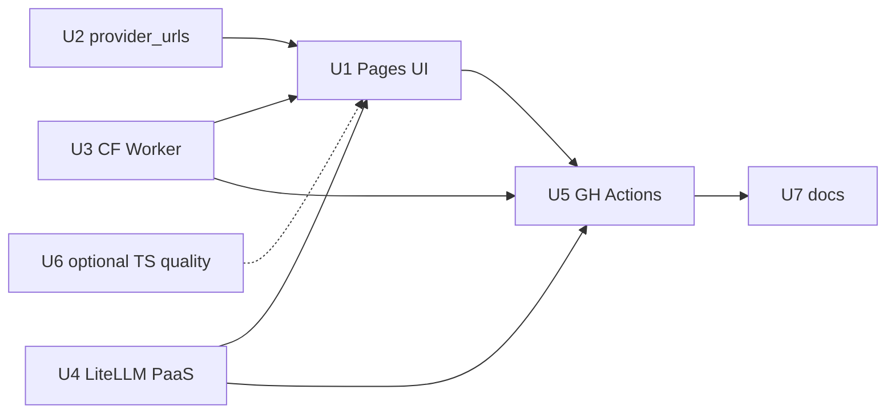

# feat: Static chat UI + best-effort free-tier proxy failover

> **Post-ship addendum:** As-built deltas, security decisions, and remediation status live in [`2026-07-24-002-post-ship-addendum.md`](2026-07-24-002-post-ship-addendum.md). Read that file before treating this plan as current operator truth.

## Summary

Ship a **static chat homepage** on GitHub Pages plus GitHub Actions deploys to a **Cloudflare Worker** primary proxy and optional **Render LiteLLM** secondary. Chat uses the existing `free` alias and daily `configs/` artifacts — not a TypeScript port of Python discovery. **Best-effort failover** on $0 tiers, not SLA-grade HA.

## Problem

The repo generates ranked free-model configs and a local Docker gateway (`deploy/`), but there was no public demo and no multi-surface free hosting story. Goal: Open WebUI-like chat as the default homepage, routed through llm-fallbacks ranking, with HA across free SaaS — preferably without running a backend.

Research conclusion: **browser-only routing with hidden repo keys is not viable** for zero-config demos. Optional **BYOK** (user keys in `localStorage`) remains valid. A **thin edge proxy + optional LiteLLM container** is the minimal secure architecture. **Full llm-fallbacks in TypeScript is unnecessary** — consume `free_models.json` and `litellm_config_free.yaml`. **True HA on $0** is not achievable; **best-effort failover** is the honest target.

---

## Requirements

- R1. GitHub Pages serves a static chat UI at the repo default homepage (`https://bodecloud.github.io/llm_fallbacks/`).
- R2. UI loads model catalog from llm-fallbacks artifacts (`free_models.json`); default chat model is `free`.
- R3. Chat requests never embed provider API keys in static assets; keys live only in Worker secrets or PaaS env vars.
- R4. Primary OpenAI-compatible API: Cloudflare Worker with CORS allowlist, guest token auth, rate limits, model allowlist from `free_models_ids.txt`.
- R5. Secondary API: LiteLLM on one free PaaS (Render **or** Koyeb) using `generate_configs --deploy` output and existing `free` alias chain.
- R6. Client-side endpoint failover between primary Worker URL and secondary LiteLLM URL on 429/5xx/timeout.
- R7. GitHub Actions deploy UI on `docs/**` changes; deploy/update proxies when configs or proxy code change; daily config refresh continues via existing workflow.
- R8. No full TypeScript port of Python discovery; optional small TS module for `heuristic_v1` display only.
- R9. Document cold-start behavior, security model, and `$0` HA limits in user-facing docs.

---

## Key Technical Decisions

| ID | Decision | Rationale |
|----|----------|-----------|
| KTD1 | **`webui/` → `docs/` build** + `deploy-pages.yml` | CI runs esbuild; murm-ui chat + ResearchWizard shell; output committed to Pages root |
| KTD2 | **Worker holds provider secrets** | Only layer that can safely call OpenRouter/Groq from a public site |
| KTD3 | **LiteLLM on Render/Koyeb, not Vercel/Fly** | LiteLLM needs long-running Python; Fly has no free tier for new users; Vercel cannot host LiteLLM container |
| KTD4 | **Consume artifacts, don't port `config.py`** | Daily CI publishes `free_models.json`; Worker gets `MODEL_CHAIN` (first ID) + `ALLOWED_MODELS` (top 20) via wrangler vars at deploy — KV used for rate limits/metrics, not model-ID caching |
| KTD5 | **Worker short chain + Workers AI; LiteLLM full `free` chain** | Worker CPU/subrequest limits favor thin routing (`openrouter/free` + Workers AI tail); full ranked chain on secondary LiteLLM only |
| KTD6 | **Guest proxy token, not provider keys in browser** | `PROXY_GUEST_TOKEN` validated at Worker/LiteLLM; rotatable independently |
| KTD7 | **Client endpoint list for failover** | Free tier lacks DNS LB; UI tries endpoints sequentially on failure (health pre-check optional v1.1) |
| KTD8 | **Defer Open WebUI** | Resource-heavy Python app incompatible with Pages + 512MB free PaaS |
| KTD9 | **`provider_urls.json` artifact** | Generated alongside `free_models.json`; removes hardcoded provider bases in UI/Worker |

---

## High-Level Technical Design

```mermaid
flowchart TB
  subgraph pages [GitHub Pages]
    UI[docs/chat SPA]
  end

  subgraph ci [GitHub Actions]
    DAILY[daily-config-update]
    DEPLOY[deploy-pages + deploy-proxies]
  end

  subgraph artifacts [raw.githubusercontent.com]
    FM[free_models.json]
    PU[provider_urls.json]
    CP[chat_proxy.json]
    YAML[litellm_config_free.yaml]
  end

  subgraph edge [Cloudflare Worker - primary]
    W[/v1/chat/completions]
  end

  subgraph paas [Render or Koyeb - secondary]
    LM[LiteLLM model: free]
  end

  DAILY --> FM & PU & CP & YAML
  DEPLOY --> W & LM & CP
  UI -->|fetch catalog| FM
  UI -->|zero-config endpoints| CP
  UI -->|chat + failover| W
  UI -->|fallback| LM
  W -->|short chain| PR[Provider APIs]
  LM -->|full chain| PR
```

**Failover semantics:** Client UI retries the next configured endpoint on 5xx, timeout, model-not-found—not on 400. **429 (quota):** endpoint switching does not increase shared OpenRouter capacity; Worker internal Workers AI fallback handles upstream quota pressure. Worker handles in-proxy short chain + Workers AI internally. Secondary may cold-start 30–60s after spin-down — first retry may need user refresh.

---

## Scope Boundaries

**In scope (v1)**

- Static chat UI, Pages workflow, repo homepage config docs
- CF Worker proxy (TypeScript)
- One LiteLLM free PaaS deploy + deploy hook workflow
- Client endpoint failover (2 URLs)
- `provider_urls.json` generator (U2 — shipped in `configs/`)
- Security: CORS allowlist, rate limit, model allowlist, max_tokens cap

**Out of scope (v1)**

- Open WebUI / LibreChat
- Full `llm-fallbacks` TypeScript port
- Fly.io (no free tier), Vercel for LiteLLM hosting
- Paid DNS/load-balancer HA
- Browser-direct provider calls with repo-owned keys
- Multi-instance LiteLLM behind LB on free tier

### Deferred to Follow-Up Work

- Cloudflare AI Gateway managed fallbacks layer
- Third backup endpoint (Northflank free tier evaluation)
- Hot reload without LiteLLM restart (deferred — see plan 001 gateway work)
- `packages/catalog` npm publish for external consumers
- Keep-alive cron to reduce PaaS cold starts (document ToS tradeoffs)

---

## System-Wide Impact

| Surface | Impact |
|---------|--------|
| `docs/` | New static chat UI (Pages root) |
| `edge/` | Cloudflare Worker primary proxy |
| `generate_configs.py` | Adds `provider_urls.json` generation; ensure `free` alias in committed YAML |
| `.github/workflows/` | `deploy-pages.yml`, `deploy-proxies.yml` |
| `README.md` | Homepage demo link, architecture diagram |
| `STRATEGY.md` | Already written; aligns tracks |
| Secrets | `OPENROUTER_API_KEY`, `LITELLM_MASTER_KEY`, `PROXY_GUEST_TOKEN`, `RENDER_DEPLOY_HOOK` / Koyeb API — platform only |

---

## Risks and Dependencies

| Risk | Mitigation |
|------|------------|
| Public demo burns OpenRouter quota | Rate limit per IP; low max_tokens; optional CF Access for personal use |
| Render/Koyeb cold start | Document latency; optional health ping workflow; client timeout messaging |
| Worker 100k req/day cap | Secondary LiteLLM absorbs overflow via client failover |
| CORS misconfiguration | Test from Pages origin; allowlist exact GitHub Pages URL |
| Committed YAML missing `free` alias | Regenerate configs in CI; verify in deploy workflow |
| Abuse of guest token | Rotate token; cap requests; monitor Worker analytics |

**Dependencies:** Cloudflare account, Render or Koyeb account, GitHub Pages enabled (Actions source), existing llm-fallbacks daily CI.

---

## Implementation Units

### U1. Static chat UI on GitHub Pages

**Goal:** Streaming chat homepage built from `webui/` (murm-ui + ResearchWizard shell) calling configured proxy endpoints with client-side failover.

**Requirements:** R1, R2, R6

**Dependencies:** U3, U4 (proxy URLs available in `configs/chat_proxy.json` / `docs/config.js`)

**Files:**

- `webui/` — source (plugins, FailoverProvider, shell panels)
- `docs/index.html`, `docs/assets/*` — CI build output
- `docs/chat-ui-plugins.md` — plugin authoring guide
- `.github/workflows/deploy-pages.yml` — triggers on `docs/**`, `webui/**`, `configs/chat_proxy.json`

**Approach:**

- `cd webui && npm ci && npm run build` writes `docs/assets/chat.js`, shell CSS, and `docs/index.html`.
- **Chat engine:** murm-ui `ChatUI` + `IndexedDBStorage`.
- **Routing:** `FailoverProvider` — cloud proxy first (SSE), optional browser BYOK fallback.
- **Shell:** ai-researchwizard top bar + slide-in panels; plugins via `registerShellPanel` (failover-settings, byok-settings, model-explorer).
- Fetch `free_models.json` and merge `configs/chat_proxy.json` for zero-config endpoints (`seedZeroConfigFromPageConfig`).
- Default model `free`; model explorer browses catalog; default model set in Failover panel.
- Store only `PROXY_GUEST_TOKEN` in UI config (public via `docs/config.js` — not provider keys).

- **Interaction states (v1):** catalog fetch loading/error; empty-chat welcome hero; streaming in progress; proxy failover status line; all-endpoints-failed error; bootstrap fatal (`.boot-error`); optional BYOK route messaging.

**Test scenarios:**

- Happy path: Playwright loads Pages, sends chat, receives streamed assistant reply.
- Failover: first endpoint returns 503, second succeeds (mock or live secondary when configured).
- Edge: bootstrap failure shows `.boot-error`; empty catalog shows error state.

**Verification:** Pages deploy succeeds; live site at `https://bodecloud.github.io/llm_fallbacks/`; Playwright e2e pass against production URL.

---

### U2. Provider URLs artifact

**Status:** Shipped — `configs/provider_urls.json` generated by `generate_configs.py`.

**Goal:** Generated map of provider → OpenAI-compatible base URL for UI metadata and Worker validation.

**Requirements:** R2, R9

**Dependencies:** None

**Files:**

- `src/llm_fallbacks/generate_configs.py`
- `tests/test_generate.py`
- `configs/provider_urls.json` (generated)

**Approach:**

- Emit `{ "openrouter": "https://openrouter.ai/api/v1", ... }` from `CUSTOM_PROVIDERS` during `generate()`.
- Document raw URL in `configs/README.md`.

**Test scenarios:**

- Happy path: JSON contains known providers from fixtures.
- Regression: existing artifacts unchanged in shape.

**Verification:** File present after `generate_configs`; UI can remove hardcoded `PROVIDER_URLS`.

---

### U3. Cloudflare Worker primary proxy

**Goal:** OpenAI-compatible edge proxy with secrets, CORS, allowlist, short fallback chain.

**Requirements:** R3, R4, R6

**Dependencies:** U2 (optional)

**Files:**

- `edge/` — `src/index.ts`, `wrangler.toml`, `package.json`
- `.github/workflows/deploy-proxies.yml` (Worker job)

**Approach:**

- `POST /v1/chat/completions` — validate guest token header.
- On `model: free`, use a **short** edge chain: primary upstream (e.g. `openrouter/free` from first line of `free_models_ids.txt`) then **Workers AI** terminal fallback when upstream returns 429/5xx or unsupported routes exhaust CPU budget.
- `deploy-proxies.yml` sets `MODEL_CHAIN` from `head -n 1 configs/free_models_ids.txt` intentionally — do not expand to top-N at the edge.
- Full ranked multi-provider `free` alias chain runs on LiteLLM secondary (U4), not in Worker v1.
- Secrets: `OPENROUTER_API_KEY`, `GROQ_API_KEY`, `PROXY_GUEST_TOKEN`.
- CORS: `Access-Control-Allow-Origin: https://bodecloud.github.io` (and custom domain if set).
- Rate limit via KV counter per IP (simple fixed window) — numeric thresholds TBD (see Open Questions).
- Reference: [cloudflare-llm-gateway](https://github.com/leeguooooo/cloudflare-llm-gateway), [Stackbilt llm-providers](https://github.com/Stackbilt-dev/llm-providers).

**Test scenarios:**

- Unit: model allowlist rejects unknown model.
- Unit: fallback tries next provider on 429 mock.
- Integration: `wrangler dev` + curl from allowed origin.

**Verification:** Worker deploy; curl chat completion with guest token succeeds.

---

### U4. LiteLLM secondary on free PaaS

**Goal:** Deploy existing `deploy/` stack to Render or Koyeb as secondary endpoint.

**Requirements:** R5, R7

**Dependencies:** None (secondary URL injected via deploy-generated `configs/chat_proxy.json` / `docs/config.js`)

**Files:**

- `deploy/render.yaml` or `deploy/koyeb.toml` (platform-specific)
- `.github/workflows/deploy-proxies.yml` (PaaS job)
- `deploy/README.md` (update cloud section)

**Approach:**

- Slim profile: drop Redis if 512MB OOM; use deploy-mode YAML (`disable_spend_logs`, no observability callbacks).
- Env: `LITELLM_MASTER_KEY` (operator-only, never shipped to Pages), `OPENROUTER_API_KEY`, `DATABASE_URL` empty.
- **Public demo key:** issue a LiteLLM virtual key or route-scoped proxy credential limited to `POST /v1/chat/completions` and model `free` only. This value may appear in `docs/config.js` as `PROXY_GUEST_TOKEN` — **never** reuse `LITELLM_MASTER_KEY` as the browser token.
- Bootstrap config: `update-config.sh --once` on start or mount raw YAML from GitHub at deploy.
- Expose HTTPS URL to `configs/chat_proxy.json` (appended after deploy hook succeeds).
- Render deploy hook or Koyeb API triggered from workflow after config artifact upload.

**Test scenarios:**

- Test expectation: none — manual smoke on platform.

**Verification:** `/health/liveliness` returns OK; chat with `model: free` works with the **scoped public demo key** (not master key).

---

### U5. GitHub Actions orchestration

**Goal:** Wire Pages deploy + proxy deploy + config refresh triggers.

**Requirements:** R7

**Dependencies:** U1, U3, U4

**Files:**

- `.github/workflows/deploy-pages.yml`
- `.github/workflows/deploy-proxies.yml`

**Approach:**

- `deploy-pages`: on push to `main` paths `docs/**`, `webui/**`, `configs/chat_proxy.json`; runs `cd webui && npm ci && npm run build`; uses `actions/deploy-pages@v4`.
- `deploy-proxies`: on push paths `edge/**`, `deploy/**`, `configs/litellm_config_free.yaml`, or `workflow_dispatch`; jobs: generate artifact → wrangler deploy → trigger PaaS hook.
- **Endpoint bootstrap:** after Worker deploy, commit/update `configs/chat_proxy.json` with Worker HTTPS URL; after U4 PaaS hook succeeds, append secondary URL from `LITELLM_URL` secret (launch gate — AE2 requires two endpoints when secondary is configured).
- Reuse `OPENROUTER_API_KEY` secret from daily workflow pattern.
- Document required repo secrets (`LITELLM_URL`, `RENDER_DEPLOY_HOOK`, etc.) in `deploy/README.md`.

**Test scenarios:**

- Workflow syntax valid (`act` or manual dispatch).
- When `LITELLM_URL` is set: `chat_proxy.json` `endpoints` array contains Worker + secondary URLs.

**Verification:** Push to branch triggers Pages; proxy workflow deploys without secret leakage in logs; Playwright e2e can assert dual endpoints when secondary secret present.

---

### U6. Client-side catalog module (deferred from v1)

**Status:** Deferred — `free_models.json` already ships `quality_score` from Python CI; UI reads pre-sorted order. No `packages/catalog/` npm publish in v1.

**Goal:** Optional small TS library for quality score display—not discovery.

**Requirements:** R8 (optional)

**Dependencies:** None (parallel when revived)

**Files (if revived):**

- `docs/js/quality.js` (single file port of `heuristic_v1`) — prefer over `packages/catalog/`

**Approach:**

- Port `compute_quality_score()` only (~80 lines math) only if UI must recompute scores client-side.
- **Do not** port `config.py`, `core.py`, or LiteLLM fetch.

**Test scenarios:**

- Parity tests against Python fixtures (export JSON test vectors from `test_quality.py`).

**Verification:** Scores match Python within epsilon for fixture specs.

---

### U7. Documentation and homepage setup

**Goal:** Make chat the default repo entry point; document HA limits honestly.

**Requirements:** R9

**Dependencies:** U1, U5

**Files:**

- `README.md`
- `AGENTS.md`
- `STRATEGY.md` (exists)
- GitHub repo About/Website field (manual step documented)

**Approach:**

- README badge/link: "Try the chat demo".
- Document: not HA in SLA sense; cold starts; guest token rotation.
- AGENTS.md: add `docs/`, `edge/` scope.

**Security Model (public demo):**

- `PROXY_GUEST_TOKEN` in `docs/config.js` is a **public demo capability gate**, not user authentication. Anyone can extract it and call the Worker/LiteLLM API via curl — CORS only protects browser-origin chat, not scripted abuse.
- Real abuse controls: per-IP rate limits, global daily caps, low `max_tokens`, monitoring via Worker analytics and `/v1/metrics`. Token rotation is incident response, not prevention.
- Provider secrets (`OPENROUTER_API_KEY`, etc.) live only in Worker/PaaS env — never in Pages static assets.
- Optional BYOK (user keys in `localStorage`) is a separate browser-direct path; distinct from zero-config demo routing.
- Optional Cloudflare Access for operator-only deployments (personal use, not public demo).

**Demo contract (public surface):**

- **Supported:** zero-config ranked-free-model chat demo, BYOK for power users, best-effort endpoint failover when secondary is configured.
- **Not supported:** SLA uptime, guaranteed availability, unlimited quota, abuse-free public access without rate limits.
- Maintainer may throttle, rotate tokens, or disable the demo when quotas exhaust — document graceful degradation copy in UI.

**Test scenarios:**

- Test expectation: none.

**Verification:** New contributor can follow README to run Pages locally + point at Worker dev URL.

---

## Open Questions

| Question | Status | Owner |
|----------|--------|-------|
| Render vs Koyeb for secondary | Render chosen for v1 (render.yaml + deploy hooks) | Closed |
| Vite build vs single HTML file | webui/ esbuild pipeline (supersedes single HTML MVP) | Closed |
| CF AI Gateway in front of Worker | Defer to follow-up | — |
| Regenerate committed YAML with `free` alias before launch | Run `generate_configs` in CI or manual commit | Implementer |
| Numeric rate limits (per IP, global daily) | Closed — 30/min, 300/day in `edge/wrangler.toml` | Operator |
| Accessibility requirements (keyboard panels, aria-live streaming) | TBD — add to U1 acceptance when shell panels stabilize | Implementer |
| LiteLLM virtual key issuance automation | Manual setup for v1; automate in deploy-proxies follow-up | Implementer |

---

## Sources and Research

- `STRATEGY.md` (2026-07-24)
- `docs/plans/2026-07-24-001-feat-self-hosted-free-gateway-plan.md` (local Docker gateway — extended, not replaced)
- ce-feasibility-reviewer: Tier A/B/C analysis; browser keys infeasible; no full TS port
- ce-best-practices-researcher: Worker + Render pattern, security controls, reference repos
- ce-repo-research-analyst: Pages constraints, artifact URLs, prototype branch note
- [Cloudflare AI Gateway fallbacks](https://developers.cloudflare.com/ai-gateway/configuration/fallbacks/)
- [LiteLLM proxy reliability](https://docs.litellm.ai/docs/proxy/reliability)

**External research load-bearing:** Yes — free-tier platform limits and static-site security model shaped KTD2–KTD7.

---

## Acceptance Examples

- AE1. Visitor opens `https://bodecloud.github.io/llm_fallbacks/`, sees chat UI, sends message with default `free`, receives streamed reply via Worker or secondary.
- AE2. When secondary is configured (`LITELLM_URL` / dual endpoints in `chat_proxy.json`): UI fails over to LiteLLM URL within client retry logic on Worker outage (simulated 503).
- AE3. View-source on Pages site shows no `OPENROUTER_API_KEY` or provider secrets.
- AE4. Daily CI updates `free_models.json`; proxies align within 24h via redeploy-on-config-change (U5 `deploy-proxies` trigger on `configs/litellm_config_free.yaml`).

---

## Sequencing

```mermaid
flowchart LR
  U2[U2 provider_urls] --> U1[U1 Pages UI]
  U3[U3 CF Worker] --> U1
  U4[U4 LiteLLM PaaS] --> U1
  U1 --> U5[U5 GH Actions]
  U3 --> U5
  U4 --> U5
  U6[U6 optional TS quality] -.-> U1
  U5 --> U7[U7 docs]
```

**Recommended order:** U3 + U4 (proxies) → U1 (UI wired to URLs) → U5 → U7. U2 and U6 parallel when convenient.

---

## Feasibility Summary (from research)

| User ask | Verdict |
|----------|---------|
| GitHub Pages chat homepage | ✅ Feasible |
| CF Worker + free PaaS routing | ✅ Feasible (Worker + 1–2 backends) |
| HA across all free providers | ⚠️ Best-effort only, not true HA |
| No backend at all | ❌ Infeasible — thin proxy required |
| Full llm-fallbacks in TypeScript | ❌ Unnecessary — consume JSON/YAML |
| Open WebUI on free static hosting | ❌ Infeasible |
| Completely free | ⚠️ Free hosting tiers; provider API spend borne by maintainer/BYOK |
