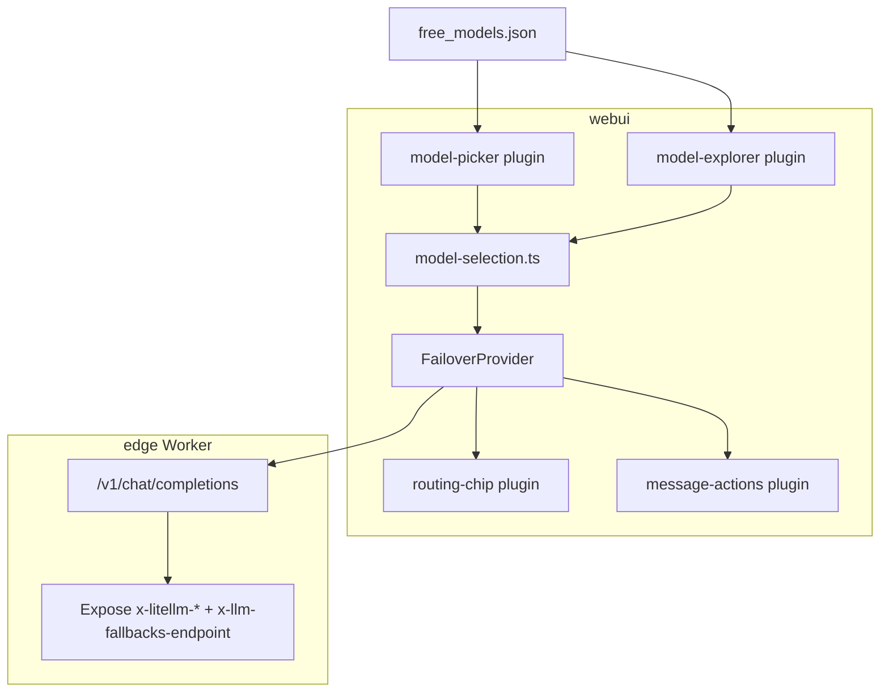
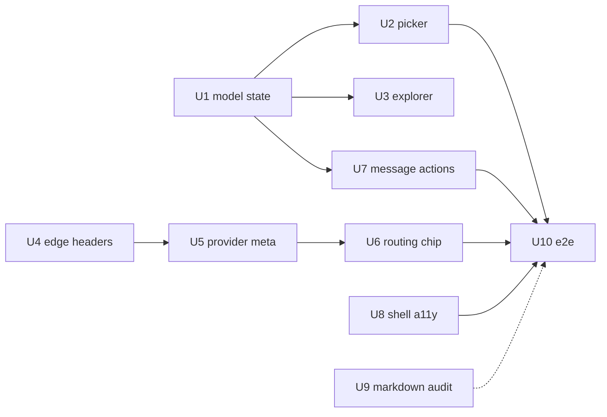

# feat: Chat UI Wave 1 — model picker, routing transparency, message controls

> **Origin:** [Chat UI improvements brainstorm](../brainstorms/2026-07-24-chat-ui-improvements-requirements.md) — Wave A (UX-first). Waves B/C (health panel, Turnstile, export/compare) are out of scope here.

## Summary

Ship table-stakes chat UX on the static GitHub Pages demo: **composer model selector** wired to `free_models.json`, **explorer → chat** selection, **regenerate/stop/edit-resubmit**, **routing chip** on assistant replies, **structured error copy**, and **shell cleanup** — without a backend or Open WebUI scope creep.

## Problem Frame

The demo works but feels simplistic vs ChatGPT-class UIs. Model choice hides in Failover settings; failover intelligence is invisible; message controls are thin; unwired ResearchWizard chrome suggests unfinished product. STRATEGY keeps static-site + edge-proxy architecture; this plan implements Wave 1 only.

## Requirements (Wave 1 traceability)

| ID | Source | Wave 1 requirement |
|----|--------|-------------------|
| R1 | Brainstorm | Composer-adjacent model selector from `free_models.json`; default `free` |
| R2 | Brainstorm | Model Explorer row action applies model to session |
| R3 | Brainstorm | Regenerate + Copy on assistant messages; Stop preserves partial output |
| R4 | Brainstorm | Edit user message and resubmit; truncate subsequent turns |
| R5 | Brainstorm | Streaming markdown without full-document flicker (verify/fix) |
| R6 | Brainstorm | Routing chip: endpoint, resolved model, fallback hops |
| R7 | Brainstorm | Surface proxy metadata headers when present |
| R8 | Brainstorm | Distinct copy for rate limit, quota, cold start, auth errors |
| R17 | Brainstorm | Baseline a11y: Enter/Shift+Enter, aria-live, focus |
| R18 | Brainstorm | Hide dead shell affordances (voice/MCP/research) |

**Explicitly deferred (Wave 2+):** R9 health panel, R10–R14 catalog/export/routing, R15–R16 Turnstile.

## Key Technical Decisions

| ID | Decision | Rationale |
|----|----------|-----------|
| KTD1 | **Per-session model override** (resolve Q1) | Picker sets model on active murm-ui session; global `defaultModel` in localStorage unchanged unless user saves Failover panel |
| KTD2 | **Model state module** in `webui/src/model-selection.ts` | Single source: `{ sessionModel?, catalog }` read by FailoverProvider, picker plugin, explorer |
| KTD3 | **Routing metadata on `StreamEvent` side-channel** | FailoverProvider captures `{ endpoint, modelHeader, fallbackCount, durationMs }` per completion; routing-chip plugin reads last metadata keyed by message id |
| KTD4 | **Edge passthrough headers** on successful chat responses | Worker forwards LiteLLM `x-litellm-*` and adds `x-llm-fallbacks-endpoint` (Worker hostname) for client chip; CORS `Access-Control-Expose-Headers` updated |
| KTD5 | **Message actions via murm-ui plugin**, not fork | `stopGeneration()` already wired in murm-ui ChatUI; regenerate/edit call ChatEngine APIs — verify at U3 start, fallback to thin wrapper plugin |
| KTD6 | **R5: audit before replace** | murm-ui may already block-memoize; only add incremental renderer if e2e/manual shows flicker on long code blocks |
| KTD7 | **R18: CSS hide + remove dead top-bar hooks** | Prefer deleting unused shell nodes/styles over new features |
| KTD8 | **No R9 in Wave 1** | Health pre-check is Wave 2 per brainstorm K5 |

## High-Level Technical Design

**Data flow (routing chip):**

1. User sends message with `options.model` from session override or `free`.
2. FailoverProvider tries endpoints sequentially; on success reads response headers + records hop count.
3. On stream complete, metadata attached for routing-chip plugin to render under assistant bubble.
4. Analytics `chat_completion_success` event includes route string (existing) plus optional model header.

## Implementation Units

### U1. Model selection state (R1 foundation)

**Goal:** Shared per-session model id with catalog load.

**Files:**
- `webui/src/model-selection.ts` (new)
- `webui/src/storage-keys.ts` — optional `sessionModel` key if persistence across reload desired (default: session-only in murm-ui engine state, not localStorage)
- `webui/src/main.ts` — pass getter into plugins/provider

**Approach:**
- Export `getActiveModel()`, `setActiveModel(id)`, `getCatalogModels()` wrapping catalog ref from bootstrap.
- Seed active model as `free` or restored session value.
- FailoverProvider reads `getActiveModel()` when building chat body (override `config.defaultModel`).

**Test scenarios:**
- Default model is `free` on fresh load.
- After `setActiveModel("groq/...")`, next chat request body uses that id.
- Failover panel `defaultModel` still applies when no session override (document behavior in comment).

**Verification:** Unit test in `webui/` vitest if pure functions; else Playwright in U8.

---

### U2. Composer model picker plugin (R1, R11 partial)

**Goal:** Dropdown/combobox adjacent to chat input listing catalog + pinned `free` / `openrouter/free`.

**Files:**
- `webui/src/plugins/model-picker/index.ts` (new)
- `webui/shell/chat-overrides.css` — layout for picker in toolbar/form row
- `webui/src/main.ts` — register plugin

**Approach:**
- murm-ui plugin `onMount`: inject selector into `.mur-chat-form` or header via DOM hook (match existing `wireChatInputIds` pattern).
- Options: `{ id: "free", label: "free (ranked alias)" }`, `{ id: "openrouter/free", label: "openrouter/free" }`, then top N from catalog by quality_score.
- One-line help: "`free` = our ranked chain; `openrouter/free` = OpenRouter meta-router" (R11).
- On change: `setActiveModel()`.

**Test scenarios:**
- Picker visible on load; selecting a catalog model changes subsequent request model (mock intercept).
- `free` remains first/default option.

**Verification:** Playwright `tests/e2e/model-picker.spec.ts` (new, mocked catalog + proxy).

---

### U3. Model Explorer → chat (R2)

**Goal:** "Use for chat" on table rows.

**Files:**
- `webui/src/plugins/model-explorer/index.ts`
- `webui/shell/chat-overrides.css` — row action button styles

**Approach:**
- Add column or row click handler: `setActiveModel(row.id)` + toast/status "Model set to …".
- Sync picker UI if mounted (custom event `llm-fallbacks:model-changed`).

**Test scenarios:**
- Click model id in explorer → picker reflects selection → chat uses model (mock).

**Verification:** Extend model-picker e2e or explorer unit test.

---

### U4. Edge response header passthrough (R7)

**Goal:** Browser can read routing metadata from proxy responses.

**Files:**
- `edge/src/index.ts` — after upstream success, copy/append headers on Response
- `edge/test/handler.test.ts` — assert exposed headers in CORS

**Approach:**
- On successful chat response, set:
  - `x-llm-fallbacks-endpoint: <worker host or upstream base>`
  - Forward when present: `x-litellm-model-name`, `x-litellm-attempted-failbacks`, `x-litellm-response-duration-ms`
- Add to CORS expose list in `corsHeaders()` / `ALLOWED_ORIGINS` handler.

**Test scenarios:**
- Mock upstream returns `x-litellm-model-name`; client-side fetch in test sees header.
- OPTIONS/preflight exposes header names.

**Verification:** `cd edge && npm test`

**Execution note:** LiteLLM on Render may not emit all headers until verified live — chip degrades gracefully (endpoint only).

---

### U5. FailoverProvider routing metadata + error taxonomy (R6, R7, R8)

**Goal:** Capture headers and hops; throw typed errors for UI.

**Files:**
- `webui/src/providers/FailoverProvider.ts`
- `webui/src/providers/routing-metadata.ts` (new)
- `webui/src/providers/errors.ts` (new) — map status/body → `RateLimitError`, `QuotaError`, `ColdStartError`, `AuthError`, `ProxyUnavailableError`

**Approach:**
- In `streamProxyFallback`, increment hop index per endpoint attempt; on success parse headers before SSE consume.
- Store `lastCompletionMeta` for plugins; attach message id if murm-ui exposes callback (or emit window event).
- Map HTTP 401 → AuthError, 429 → RateLimitError, 502/503 with cold-start heuristics → ColdStartError, OpenRouter quota strings in body → QuotaError.
- User-facing messages in errors.ts (no generic "Error").

**Test scenarios:**
- Mock 429 → error message mentions retry/rate limit.
- Mock 401 on second endpoint → message mentions auth / guest token.
- Two-hop success → metadata.fallbackCount === 1.

**Verification:** Vitest on `errors.ts`; extend `tests/e2e/failover-dual-endpoint.spec.ts` for chip text.

---

### U6. Routing chip plugin (R6)

**Goal:** Compact metadata under each assistant message.

**Files:**
- `webui/src/plugins/routing-chip/index.ts` (new)
- `webui/shell/chat-overrides.css`

**Approach:**
- Plugin listens for completion / observes `lastCompletionMeta`.
- Render chip: `Worker · openrouter/free · 1 fallback` (truncate URLs to hostnames).
- Hide chip when metadata empty (browser-only route).

**Test scenarios:**
- Mock dual-endpoint failover → chip shows second host.
- Single success → chip shows endpoint + model if header present.

**Verification:** Playwright assertion on `.lf-routing-chip` (class TBD).

---

### U7. Message actions — regenerate, stop, edit (R3, R4)

**Goal:** Table-stakes message controls.

**Files:**
- `webui/src/plugins/message-actions/index.ts` (new)
- `webui/src/main.ts`

**Approach:**
- **Stop:** Confirm murm-ui stop button visible; style if hidden. Engine already calls `stopGeneration()`.
- **Regenerate:** Plugin adds control on assistant messages → re-submit prior user turn with same model.
- **Edit:** Plugin adds control on user messages → inline edit → truncate messages after index → resubmit.
- Use ChatEngine public API from plugin context (`engine` param in plugins factory) — **execution-time:** read murm-ui 0.2.0 API in `node_modules` at start of unit; if regenerate not supported, implement via `engine.sendMessage` with trimmed history.

**Test scenarios:**
- Stop mid-stream leaves partial assistant text.
- Regenerate produces second assistant message for same user prompt.
- Edit user message removes following turns.

**Verification:** Playwright `tests/e2e/message-actions.spec.ts` (mock SSE).

---

### U8. Shell cleanup + a11y pass (R17, R18)

**Goal:** Remove misleading chrome; baseline accessibility.

**Files:**
- `webui/shell/styles.css` or `webui/index.template.html` — remove/hide voice/MCP/research affordances not used
- `webui/shell/chat-overrides.css` — aria-live on feed, focus rings
- `docs/index.html` (via template rebuild)

**Approach:**
- Grep shell CSS for `#voiceInputBtn`, MCP, research panels — hide with `[hidden]` or delete from template if present.
- Ensure `#chatinput` has `aria-label`; assistant feed region `aria-live="polite"`.
- Document Enter/Shift+Enter behavior matches murm-ui defaults.

**Test scenarios:**
- View source / e2e: no visible voice/MCP buttons.
- axe or manual: chatinput labeled.

**Verification:** Extend `tests/e2e/ux-deep-audit.spec.ts` or lightweight a11y check.

---

### U9. Streaming markdown audit (R5 — conditional)

**Goal:** Only fix if flicker confirmed.

**Files:** TBD — possibly `webui/src/plugins/stream-markdown/` or murm-ui config hook.

**Approach:**
- Manual test: long code block stream on production; if flicker absent, close U9 as no-op with note in plan addendum.
- If flicker present: evaluate `stream-md` or tail-only re-render wrapper (minimal dependency).

**Test scenarios:**
- Stream 200+ token code fence; DOM mutation count stable after first block closed.

**Verification:** Optional visual e2e or skipped with documented rationale.

---

### U10. E2E suite + docs (success criteria)

**Goal:** CI coverage for Wave 1 acceptance.

**Files:**
- `tests/e2e/model-picker.spec.ts`
- `tests/e2e/message-actions.spec.ts`
- `tests/e2e/routing-chip.spec.ts`
- `tests/e2e/helpers.ts` — shared mocks for catalog + headers
- `.github/workflows/deploy-pages.yml` — include new specs in mocked e2e job
- `configs/README.md` — fix "model picker" claim
- `docs/chat-ui-plugins.md` — document new plugins

**Test scenarios:**
- AE-W1: User selects model from composer, sends chat, sees routing chip (mock headers).
- AE-W1b: Regenerate + stop paths green.

**Verification:** `cd webui && npm run build && npx playwright test tests/e2e/model-picker.spec.ts tests/e2e/message-actions.spec.ts tests/e2e/routing-chip.spec.ts`

## Sequencing

**Recommended order:** U1 → U4 (parallel) → U2 → U3 → U5 → U6 → U7 → U8 → U9 (spike) → U10

## Scope Boundaries

**In scope:** `webui/`, `edge/` header passthrough only, `tests/e2e/`, plugin docs, `configs/README.md` fix.

**Out of scope:** R9 health panel, Turnstile, export/share, hash routing, virtual-key automation, murm-ui fork, Open WebUI.

## Risks & Dependencies

| Risk | Mitigation |
|------|------------|
| murm-ui lacks regenerate/edit API | Spike at U7 start; fallback truncate+resend via engine |
| LiteLLM headers absent on Worker path | Chip shows endpoint + client hop count only |
| Render 401 on failover | R8 auth error copy; chip shows failed endpoint |
| Bundle size from markdown lib | U9 optional; defer if murm-ui sufficient |

## Acceptance Examples

- **AE1.** Visitor opens homepage, picks `gemini/...` from composer, sends "hello", sees reply with chip containing Worker hostname — without opening Server panel.
- **AE2.** Explorer row "Use for chat" updates composer selection; next message uses that model.
- **AE3.** User hits Stop during stream; partial text remains; Regenerate produces new assistant message.
- **AE4.** Worker returns 429; chat shows rate-limit message, not generic error.
- **AE5.** Playwright Wave 1 specs green in deploy-pages CI.

## Open Questions

| ID | Question | Owner | Default |
|----|----------|-------|---------|
| Q1 | Persist session model in localStorage across reload? | Planning | No — session-only unless user asks |
| Q2 | Picker shows all catalog or top 50 by score? | U2 | Top 50 + search filter |

## Sources / Research

- `docs/brainstorms/2026-07-24-chat-ui-improvements-requirements.md` — R1–R18, Wave A scope
- `webui/src/main.ts`, `webui/src/providers/FailoverProvider.ts` — current wiring
- `webui/src/plugins/model-explorer/index.ts` — browse-only gap
- `docs/assets/chat.js` — murm-ui `stopGeneration` already present
- [LiteLLM response headers](https://docs.litellm.ai/docs/proxy/response_headers)
- [TheFrontKit AI chat UX 2026](https://thefrontkit.com/blogs/ai-chat-ui-best-practices)
- `docs/CAVEATS.md` — Render auth limitation for chip copy
