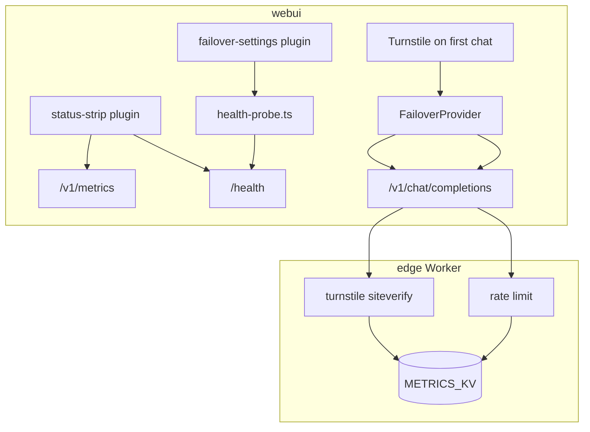
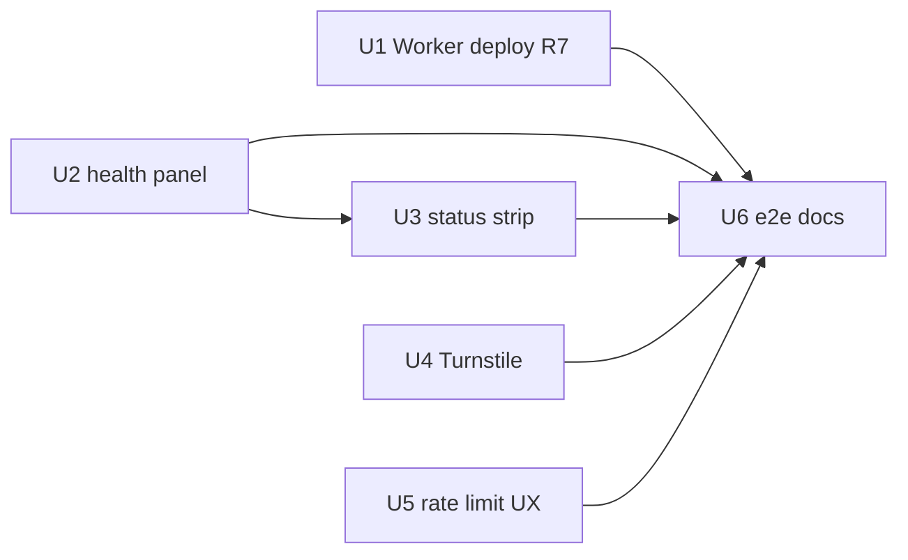

# feat: Chat UI Wave 2 — health panel, Turnstile, rate-limit UX

> **Origin:** [Chat UI improvements brainstorm](../brainstorms/2026-07-24-chat-ui-improvements-requirements.md) — Wave B (trust & ops). Wave C (catalog richness, export, hash routing) remains out of scope.

## Summary

Harden the public demo for sustainability and operator trust: **live endpoint health** in the Server panel, a lightweight **status strip** from existing Worker `/health` and `/v1/metrics`, **Cloudflare Turnstile** gating guest chat, and **rate-limit UX** that surfaces `Retry-After` — plus **Worker redeploy** to finish Wave 1 routing-header passthrough (R7).

## Problem Frame

Wave 1 made the chat feel like a real product. Wave 2 addresses what visitors cannot see but operators need: knowing which proxy is up, absorbing bot abuse without burning quota, and getting actionable feedback when limits hit. STRATEGY keeps static Pages + edge proxy; no accounts backend.

## Requirements (Wave 2 traceability)

| ID | Source | Wave 2 requirement |
|----|--------|-------------------|
| R7 | Brainstorm (carryover) | Worker exposes LiteLLM/Worker metadata headers to browser (code merged; **deploy + verify live**) |
| R9 | Brainstorm | Failover settings show **live endpoint status** (reachable / degraded / unreachable) from lightweight checks |
| R15 | Brainstorm | Public demo evaluates **Turnstile → short-lived session** at Worker before guest-token chat (fail-open in local dev) |
| R16 | Brainstorm | KV rate limits remain; UI communicates **429** with retry guidance (extend Wave 1 error taxonomy) |
| R9b | Brainstorm B | Minimal **status strip** fed by `/health` + `/v1/metrics` (operator-visible, optional for visitors) |

**Explicitly deferred (Wave 3 / C):** R10–R14 catalog differentiation, export/share, hash routing, model compare.

## Key Technical Decisions

| ID | Decision | Rationale |
|----|----------|-----------|
| KTD1 | **Client-side health probes** from failover panel | Each configured base URL gets `GET {base}/health` (or `/health/liveliness` for LiteLLM) with 5s timeout; no new Worker route required |
| KTD2 | **Health states:** ok / slow (>2s) / fail | Three-state UX matches “reachable / degraded / unreachable” without synthetic traffic to `/v1/chat/completions` |
| KTD3 | **Turnstile verify at Worker** on first chat per session | Pages loads Turnstile widget once; Worker validates token via siteverify, stores `turnstile:ok:{ip}` in METRICS_KV (TTL 1h); skip when `TURNSTILE_SECRET` unset |
| KTD4 | **Fail-open without Turnstile secret** | Local dev and CI mocks unchanged; production requires secret in wrangler + Pages site key in `docs/config.js` |
| KTD5 | **Status strip in credits bar** | Single line: Worker liveness + optional 24h `chat_completion_success` from `/v1/metrics?days=1` — collapses on mobile |
| KTD6 | **429 UX reads `Retry-After` header** | FailoverProvider maps header seconds into RateLimitError message; no client-side rate counter |
| KTD7 | **Render health uses `/health/liveliness`** | Worker uses `/health`; Render LiteLLM uses liveliness path per deploy docs |
| KTD8 | **No Turnstile on `/v1/events` or `/v1/metrics`** | Analytics and pulse endpoints stay guest-token only |

## High-Level Technical Design

## Implementation Units

### U1. Worker deploy + R7 verification (R7 carryover)

**Goal:** Production Worker serves CORS-exposed routing headers from Wave 1 edge changes.

**Files:**
- `edge/src/http.ts`, `edge/src/index.ts` (already merged)
- `.github/workflows/deploy-proxies.yml` — confirm edge path triggers deploy
- `docs/CAVEATS.md` — note header availability post-deploy

**Approach:**
- Trigger `deploy-proxies` workflow (or `workflow_dispatch`) after Wave 2 branch merges edge-touching changes.
- Manual verify: browser fetch to Worker chat with guest token; confirm `x-llm-fallbacks-endpoint` visible in response headers.
- Routing chip on live Pages should show model header when LiteLLM emits `x-litellm-model-name`.

**Test scenarios:**
- OPTIONS preflight exposes routing header names.
- Live curl/chat sees `x-llm-fallbacks-endpoint` on success response.

**Verification:** `cd edge && npm test`; live smoke on production Worker URL.

---

### U2. Health probe module + Server panel UI (R9)

**Goal:** Per-endpoint status in Failover settings with manual refresh.

**Files:**
- `webui/src/health-probe.ts` (new)
- `webui/src/plugins/failover-settings/index.ts`
- `webui/shell/chat-overrides.css` — status dot styles

**Approach:**
- Export `probeEndpoint(base: string): Promise<{ state: 'ok'|'slow'|'fail'; ms: number }>`.
- Map paths: Worker/unknown → `{base}/health`; hosts containing `onrender.com` → `{base}/health/liveliness`.
- Failover panel: render status row under Server URLs textarea; **Check endpoints** button runs parallel probes.
- Auto-probe on panel open (debounced); show last-checked timestamp.
- Degraded auth (401 on Render) surfaces as **fail** with hint linking to `docs/CAVEATS.md`.

**Test scenarios:**
- Mock 200 in <500ms → ok (green).
- Mock 200 in >2s → slow (amber).
- Mock timeout / 503 → fail (red).
- Three endpoints in textarea → three status rows.

**Verification:** Vitest on `health-probe.ts` with mocked fetch; Playwright mocked probe in failover panel.

---

### U3. Status strip plugin (R9b)

**Goal:** Compact operator-facing liveness + engagement hint in top credits bar.

**Files:**
- `webui/src/plugins/status-strip/index.ts` (new)
- `webui/src/main.ts`
- `webui/shell/chat-overrides.css`
- `webui/index.template.html` — optional mount hook in credits bar

**Approach:**
- On load (once per session): `GET {first endpoint}/health` → green/red dot + “Proxy OK” / “Proxy unreachable”.
- Optional: `GET {first endpoint}/v1/metrics?days=1` with guest token → show `chat_completion_success` count if >0 (“N chats today”).
- Hide strip entirely when health fetch fails and zero-config has no endpoints (edge case).
- Do not block chat on strip failure.

**Test scenarios:**
- Mock health 200 → strip shows OK.
- Mock metrics `{ events: { chat_completion_success: 42 } }` → strip includes count.
- Mobile viewport → strip text truncates without layout break.

**Verification:** Playwright mock; manual check on live Pages.

---

### U4. Turnstile gate at Worker (R15)

**Goal:** Bot friction before guest chat; short-lived pass in KV.

**Files:**
- `edge/src/turnstile.ts` (new)
- `edge/src/index.ts` — verify before rate limit on chat POST
- `edge/src/types.ts` — `TURNSTILE_SECRET`, `TURNSTILE_SITE_KEY` (var)
- `edge/test/turnstile.test.ts` (new)
- `webui/src/plugins/turnstile-gate/index.ts` (new)
- `webui/src/main.ts`
- `docs/config.js` generation in `.github/workflows/deploy-pages.yml` — optional `turnstileSiteKey` from secret
- `edge/README.md`, `docs/CAVEATS.md`

**Approach:**
- **Client:** Invisible/managed Turnstile widget on first `sendMessage`; obtain token; send as header `CF-Turnstile-Response` or body field on chat request (prefer header).
- **Worker:** If `TURNSTILE_SECRET` set, require valid token OR existing KV pass `ts:pass:{ip}` with TTL 3600. On success, call Cloudflare siteverify, set KV pass on success.
- If secret unset → skip verification (fail-open for dev).
- Widget site key from `window.LLM_FALLBACKS_CONFIG.turnstileSiteKey`; omit widget when key absent.

**Test scenarios:**
- No secret → chat works without token (dev).
- Secret set + invalid token → 403 with clear message.
- Secret set + valid token (mock siteverify) → chat proceeds; second request within TTL skips widget.

**Verification:** `cd edge && npm test`; Playwright with Turnstile mocked/disabled.

**Execution note:** Requires Cloudflare dashboard Turnstile site + secrets in GitHub. Document manual setup in `edge/README.md`.

---

### U5. Rate-limit UX polish (R16)

**Goal:** 429 responses show human retry time from `Retry-After`.

**Files:**
- `webui/src/providers/FailoverProvider.ts`
- `webui/src/providers/errors.ts`
- `webui/src/plugins/status-strip/index.ts` — optional “rate limited” banner on 429

**Approach:**
- On non-OK proxy response, read `Retry-After` header; pass seconds into `RateLimitError` message (“Try again in N seconds”).
- Distinguish minute vs day scope when error body includes `rate_limit` type and scope from Worker JSON.
- Wave 1 copy remains; this adds timing specificity.

**Test scenarios:**
- Mock 429 + `Retry-After: 45` → UI shows ~45s guidance.
- Mock 429 day scope → message mentions daily limit.

**Verification:** Vitest on error mapping; extend `tests/e2e/failover-dual-endpoint.spec.ts` or new mock 429 spec.

---

### U6. E2E, docs, and CONCEPTS (success criteria)

**Goal:** CI coverage and operator docs for Wave 2.

**Files:**
- `tests/e2e/health-panel.spec.ts` (new)
- `tests/e2e/turnstile-gate.spec.ts` (new, Turnstile disabled path)
- `.github/workflows/deploy-pages.yml` — include new specs in mocked e2e job
- `docs/chat-ui-plugins.md`
- `CONCEPTS.md` — **Endpoint health probe**, **Turnstile session** (if not present)
- `configs/README.md` — Turnstile optional config

**Test scenarios:**
- AE-W2a: Open Server panel → health dots appear (mocked probes).
- AE-W2b: Mock 429 → chat shows retry message with seconds.
- AE-W2c: Turnstile disabled (no site key) → chat unchanged.

**Verification:** Full mocked e2e suite green in deploy-pages CI.

## Sequencing

**Recommended order:** U1 → U2 → U5 → U3 → U4 → U6

Turnstile (U4) last — requires external dashboard setup and is highest integration risk.

## Scope Boundaries

**In scope:** `webui/`, `edge/` Turnstile + docs, Playwright e2e, `docs/config.js` Turnstile site key, Worker redeploy verification.

**Out of scope:** R10–R14 Wave C, virtual-key automation (SG-01), Open WebUI, paid HA, new rate-limit tiers, WAF rules beyond Turnstile.

## Risks & Dependencies

| Risk | Mitigation |
|------|------------|
| Turnstile secrets not configured | Fail-open when unset; document setup; U4 skippable in dev |
| Render `/health/liveliness` slow on cold start | Classify as **slow**, not fail; CAVEATS already document cold start |
| CORS blocks client health probe to Render | Probe from Worker origin only if needed; fallback: Worker-only probes in strip |
| Turnstile adds friction to legitimate users | Managed/invisible widget; 1h KV pass reduces repeat challenges |
| CF API token missing blocks Worker deploy | U1 documents manual `wrangler deploy`; R7 stays partial until deploy |

## Acceptance Examples

- **AE1.** Operator opens Server panel, clicks **Check endpoints**, sees Worker green and Render amber/red with latency ms.
- **AE2.** Visitor hits rate limit → chat shows “Try again in 60 seconds” (not generic Error).
- **AE3.** Production with Turnstile configured: first chat completes widget; subsequent chats in same hour skip it.
- **AE4.** Credits bar shows “Proxy OK · 12 chats today” when metrics available.
- **AE5.** Live routing chip includes LiteLLM model name after Worker redeploy.

## Open Questions

| ID | Question | Owner | Default |
|----|----------|-------|---------|
| Q1 | Turnstile widget: managed vs invisible? | U4 | Managed (checkbox) for accessibility |
| Q2 | Status strip visible to all visitors or operators only? | U3 | All visitors (subtle); hide metrics count if 0 |
| Q3 | Fail-closed Turnstile in prod after soak? | Deploy | Fail-open until 1 week metrics stable (brainstorm Q3) |

## Sources / Research

- `docs/brainstorms/2026-07-24-chat-ui-improvements-requirements.md` — Wave B scope, R9/R15/R16
- `docs/plans/2026-07-24-004-feat-chat-ui-wave1-ux-plan.md` — patterns, deferred items
- `edge/README.md` — `/health`, `/v1/metrics`
- `edge/src/rate-limit.ts` — existing KV limits
- [Chris House — Turnstile + edge proxy](https://blog.chrishouse.io/cloudflare-ai-gateway-turnstile/)
- [LiteLLM health checks](https://docs.litellm.ai/docs/proxy/health)
- `docs/CAVEATS.md` — Render auth, cold start
