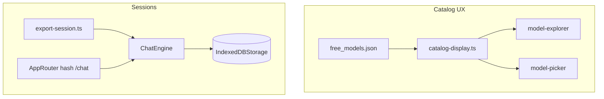
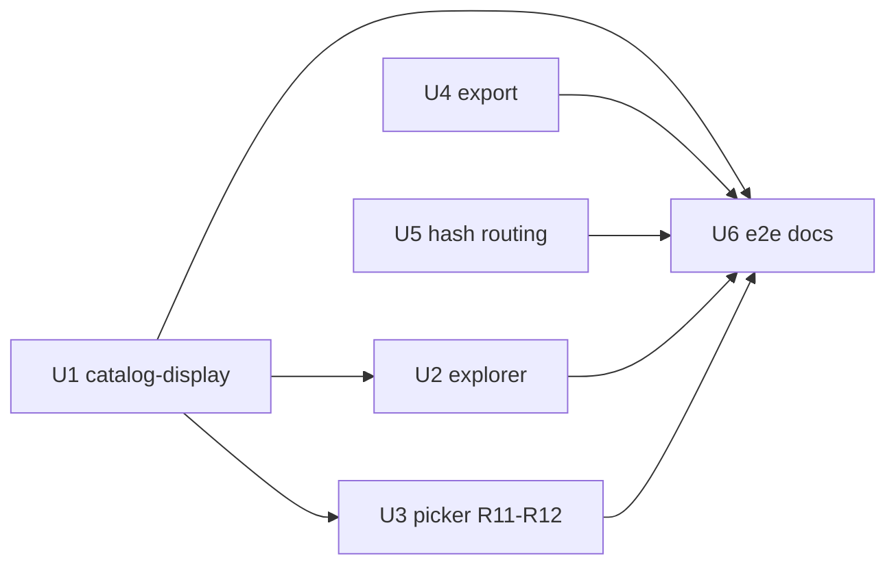

# feat: Chat UI Wave 3 — catalog differentiation, export, hash routing

> **Origin:** [Chat UI improvements brainstorm](../brainstorms/2026-07-24-chat-ui-improvements-requirements.md) — Wave C (differentiation). Waves A/B are shipped or in PR #13.

## Summary

Make the ranked-catalog story visible and the demo shareable without a backend: **richer model metadata** in explorer and picker, a **“why this rank?”** link to README scoring, **export current chat** as Markdown/JSON, and **hash deep links** to sessions via built-in murm-ui routing.

## Problem Frame

After Waves 1–2 the chat behaves like a real product (picker, routing chip, health, Turnstile). It still feels generic vs Open WebUI/LibreChat because the **daily ranked catalog** is hidden in a sparse table, sessions are trapped in IndexedDB, and URLs do not survive refresh. STRATEGY keeps static Pages — Wave 3 is client-only differentiation.

## Requirements (Wave 3 traceability)

| ID | Source | Wave 3 requirement |
|----|--------|-------------------|
| R10 | Brainstorm | Model entries show **quality score**, **context window**, and **key capabilities** (vision, tools) from `free_models.json` |
| R11 | Brainstorm | UI explains **`free` vs `openrouter/free`** in one sentence from the model selector |
| R12 | Brainstorm | Optional **“why this rank?”** tooltip/link to README quality scoring (no Python port) |
| R13 | Brainstorm | **Export conversation** as Markdown or JSON download from current IndexedDB session |
| R14 | Brainstorm | **Hash routing** `#/chat/{sessionId}` when murm-ui routing enabled — no server sync |

**Explicitly out of scope (brainstorm deferred):** side-by-side model compare, vision file upload, tool-call/reasoning UI, PWA offline shell, full TS port of discovery.

**Carryover note:** R11 partial — Wave 1 picker already shows one-line help (`free` vs `openrouter/free`). Wave 3 polishes discoverability (info control + persistent link).

## Key Technical Decisions

| ID | Decision | Rationale |
|----|----------|-----------|
| KTD1 | **Extend `CatalogEntry`** with optional artifact fields | `configs/free_models.json` already has `context_length`, `supports_vision`, `supports_function_calling`, etc.; type today only declares `id`, `mode`, `quality_score` |
| KTD2 | **`catalog-display.ts` helper** for badges and formatted context | Single formatter for explorer rows, picker subtitle, and tests — avoids duplicated capability logic |
| KTD3 | **Explorer: capability badges + context column** | Table stays scannable; badges (`vision`, `tools`) as compact pills; context as human-readable (e.g. `1M`, `128K`, `—`) |
| KTD4 | **Picker: subtitle under select** for active model | Shows score + context + badges for selected id without widening dropdown labels |
| KTD5 | **R11/R12: info cluster next to picker** | Short alias sentence + external link to README `#quality-scoring` anchor on GitHub raw/docs |
| KTD6 | **Export via `sidebarMenu` + `export-session.ts`** | murm-ui `sidebarMenu(defaults, ctx)` adds “Export Markdown / JSON”; serializes `ctx.engine.state.messages` + session meta |
| KTD7 | **Enable murm-ui hash router** | `routing: { type: "hash", pathPrefix: "/chat" }` in `ChatUI` config; replaces `routing: false` in `webui/src/main.ts` |
| KTD8 | **R14: no import/share upload** | Hash links work only when recipient has same session in their IndexedDB (document in CAVEATS); export (R13) is the portable share path |
| KTD9 | **Defer model compare** | Brainstorm explicitly deferred; exceeds static budget |

## High-Level Technical Design

## Implementation Units

### U1. Catalog types + display helpers (R10 foundation)

**Goal:** Typed access to artifact fields and shared formatters.

**Files:**
- `webui/src/providers/browser-router.ts` — extend `CatalogEntry`
- `webui/src/catalog-display.ts` (new)
- `webui/src/catalog-display.test.ts` (new)

**Approach:**
- Add optional fields: `context_length`, `max_output_tokens`, `supports_vision`, `supports_function_calling`, `supports_tool_choice`, `quality_score` (already used).
- Export `formatContextLength(n)`, `capabilityBadges(entry)`, `catalogSummaryLine(entry)`.

**Test scenarios:**
- `1050000` → `1.0M` or similar compact form
- Entry with vision + tools → badges `["vision","tools"]`
- Missing fields → graceful `—` / empty badges

**Verification:** `cd webui && npm test`

---

### U2. Model Explorer enrichment (R10)

**Goal:** Explorer table shows differentiation at a glance.

**Files:**
- `webui/src/plugins/model-explorer/index.ts`
- `webui/shell/chat-overrides.css` — badge styles

**Approach:**
- Default columns: `id`, `provider`, `quality_score`, `context`, `capabilities`, `Use`.
- `context` cell uses `formatContextLength`; `capabilities` renders badge spans.
- Optional row expand or `title` tooltip with full summary via `catalogSummaryLine` (keep table compact).

**Test scenarios:**
- Render row with mock entry shows score + context + vision badge.
- Sort by quality_score still works.

**Verification:** Vitest on render helper if extracted; Playwright explorer spec (U6).

---

### U3. Model picker subtitle + R11/R12 polish (R10–R12)

**Goal:** Composer shows why ranked catalog matters; alias help is obvious.

**Files:**
- `webui/src/plugins/model-picker/index.ts`
- `webui/shell/chat-overrides.css`

**Approach:**
- Add `#lf-model-detail` subtitle updating on `MODEL_CHANGED_EVENT` with `catalogSummaryLine(activeModel)`.
- Replace plain help paragraph with:
  - One-line R11 copy (keep existing sentence; tighten if needed).
  - Link “Why this rank?” → `https://github.com/bodecloud/llm_fallbacks#quality-scoring` (or repo-relative docs path if embedded).
- Pinned models (`free`, `openrouter/free`) show summary without catalog lookup.

**Test scenarios:**
- Select catalog model → subtitle shows score + context.
- Help link has accessible label and opens in new tab.

**Verification:** Extend `tests/e2e/model-picker.spec.ts` or new `catalog-display.spec.ts`.

---

### U4. Export session plugin (R13)

**Goal:** Download current chat as Markdown or JSON.

**Files:**
- `webui/src/export-session.ts` (new)
- `webui/src/export-session.test.ts` (new)
- `webui/src/plugins/export-session/index.ts` (new) — or wire via `sidebarMenu` in `webui/src/main.ts`
- `webui/src/main.ts`

**Approach:**
- `toMarkdown(messages, meta)` — user/assistant turns, plain text from text blocks.
- `toJson(session)` — `{ id, title, exportedAt, messages }`.
- Trigger: murm-ui `sidebarMenu` adds items “Export as Markdown” / “Export as JSON” calling `downloadBlob(filename, content)`.
- Disable when `messages.length === 0`.
- Filename pattern: `llm-fallbacks-{slug(title)}-{date}.md`.

**Test scenarios:**
- Two-message session → MD contains user + assistant lines.
- JSON parse round-trip preserves roles.
- Empty session → menu items disabled or no-op with hint.

**Verification:** Vitest on serializers; Playwright export spec (U6).

---

### U5. Hash routing enablement (R14)

**Goal:** Shareable session URLs on same device; refresh restores session when ID exists locally.

**Files:**
- `webui/src/main.ts`
- `docs/CAVEATS.md` — hash link limitation (local-only)
- `tests/e2e/hash-routing.spec.ts` (new)

**Approach:**
- Change `routing: false` → `routing: { type: "hash", pathPrefix: "/chat" }`.
- murm-ui syncs URL on session switch; `initialSessionId` from router on load.
- Document: link works for same browser/profile with that session in IndexedDB; otherwise starts new chat — use Export for cross-device share.

**Test scenarios:**
- Create chat, note URL contains `#/chat/`.
- Reload page with hash → same session messages visible (mocked provider).
- Unknown session id in hash → new empty session without crash.

**Verification:** Playwright hash-routing spec.

---

### U6. E2E, docs, CONCEPTS

**Goal:** CI coverage and operator docs.

**Files:**
- `tests/e2e/catalog-explorer.spec.ts` (new)
- `tests/e2e/export-session.spec.ts` (new)
- `tests/e2e/hash-routing.spec.ts` (new)
- `.github/workflows/deploy-pages.yml` — add specs to mocked e2e job
- `docs/chat-ui-plugins.md`
- `CONCEPTS.md` — **Session export**, **Hash session link** (if not present)
- `configs/README.md` — note artifact fields surfaced in UI

**Test scenarios:**
- AE-W3a: Explorer shows capability badge on mocked catalog row.
- AE-W3b: Export MD download triggered (Playwright download event).
- AE-W3c: Hash URL survives reload with messages.

**Verification:** Full mocked e2e green in deploy-pages CI.

## Sequencing

**Recommended order:** U1 → U2 → U3 → U4 → U5 → U6

Export and routing are independent; routing last avoids e2e flake while other UI lands.

## Scope Boundaries

**In scope:** `webui/`, Playwright e2e, docs/CAVEATS, CONCEPTS.

**Out of scope:** edge changes, compare mode, file upload, cloud session sync, README scoring algorithm changes.

## Risks & Dependencies

| Risk | Mitigation |
|------|------------|
| Wave 2 not merged yet | Branch from `main`; rebase on `feat/chat-ui-wave2` or merge PR #13 first |
| Large `free_models.json` slows explorer | Keep 200-row cap; badges are string ops only |
| Hash links confuse users expecting cloud share | CAVEATS + export as primary share path |
| murm-ui routing breaks embedded layout | Test mobile + desktop; hash prefix `/chat` matches brainstorm Q2 default |

## Acceptance Examples

- **AE1.** Visitor opens Models panel and sees quality score, context, and vision/tools badges without reading raw JSON.
- **AE2.** Picker shows “Why this rank?” linking to README quality scoring.
- **AE3.** User exports chat as `.md` and gets readable transcript.
- **AE4.** Copying URL after chat and refreshing reopens the same session (same browser).
- **AE5.** `free` vs `openrouter/free` explanation visible from composer without opening Server settings.

## Open Questions

| ID | Question | Owner | Default |
|----|----------|-------|---------|
| Q1 | Export in sidebar menu vs top bar? | U4 | Sidebar menu (murm-ui native) |
| Q2 | README link: github.com vs pages URL? | U3 | GitHub README `#quality-scoring` anchor |
| Q3 | Show `max_output_tokens` in explorer? | U2 | Omit unless column space; tooltip only |

## Sources / Research

- `docs/brainstorms/2026-07-24-chat-ui-improvements-requirements.md` — Wave C, R10–R14
- `configs/free_models.json` — artifact schema (verified fields)
- `README.md` — Quality scoring section
- `webui/node_modules/murm-ui/dist/router.d.ts` — `{ type: "hash", pathPrefix }`
- `webui/src/plugins/model-picker/index.ts` — existing R11 help text
- Prior waves: `docs/plans/2026-07-24-004-feat-chat-ui-wave1-ux-plan.md`, `docs/plans/2026-07-24-005-feat-chat-ui-wave2-trust-ops-plan.md`
