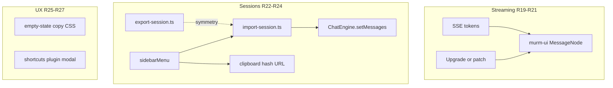
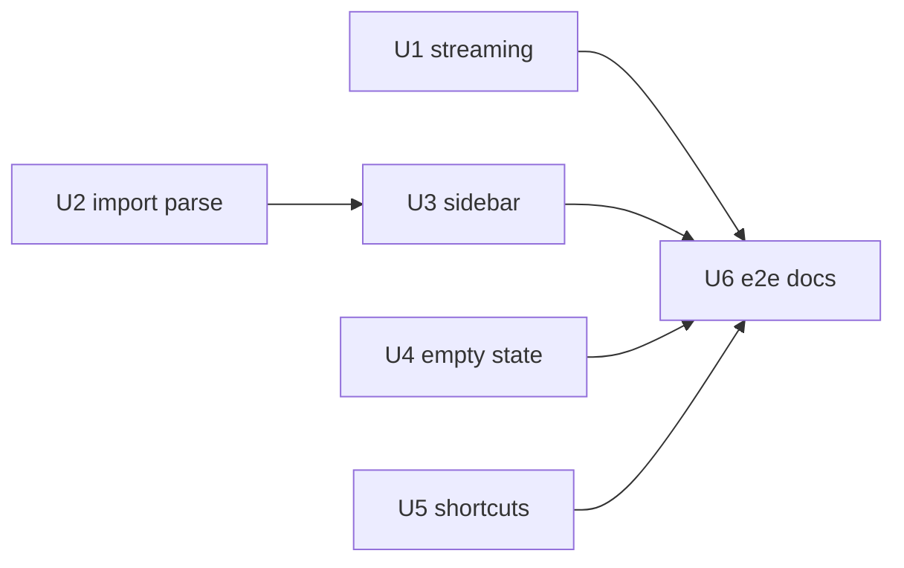

# feat: Chat UI Wave 4 — streaming polish & UX micro

> **Origin:** [Wave 4 polish brainstorm](../brainstorms/2026-07-25-chat-ui-wave4-polish-requirements.md) — closes original **R5** carryover plus session import and UX micro. Waves 1–3 in PRs [#13](https://github.com/bodecloud/llm_fallbacks/pull/13) / [#14](https://github.com/bodecloud/llm_fallbacks/pull/14).

## Summary

Fix streaming markdown jank, add **import conversation** (symmetry with Wave 3 export), **copy session link**, clearer **empty state**, and a **keyboard shortcuts** sheet — all client-only, static-first.

## Problem Frame

After Waves 1–3 the demo has model picker, routing chip, catalog badges, export, and hash links. It still reads as “basic” because long SSE replies flash when murm-ui re-parses the full markdown block every ~70ms, import is missing, and first-run affordances are buried in the embedded shell.

## Requirements (Wave 4 traceability)

| ID | Source | Wave 4 requirement |
|----|--------|-------------------|
| R19 | Wave 4 | Streaming assistant text without full-message flicker |
| R20 | Wave 4 | Closed code blocks/tables stable during stream |
| R21 | Wave 4 | Accessible streaming (`aria-live` unchanged or improved) |
| R22 | Wave 4 | Import exported MD/JSON into **new** session |
| R23 | Wave 4 | Import errors are clear; no corruption of existing sessions |
| R24 | Wave 4 | Sidebar **Copy session link** with local-only tooltip |
| R25 | Wave 4 | Empty state names ranked-`free` value + primary CTA |
| R26 | Wave 4 | `?` shortcuts sheet (Enter, Shift+Enter, Esc, `/`) |
| R27 | Wave 4 | Dismissible first-visit shortcut hint |

**Out of scope:** vision upload, model compare, tool/reasoning UI, PWA, cloud sync (see origin doc).

## Key Technical Decisions

| ID | Decision | Rationale |
|----|----------|-----------|
| KTD1 | **Spike murm-ui upgrade first** for R19–R20 | `murm-ui@^0.2.0` `MessageNode` throttles then `marked.parse` + `syncDOMChildren` on full content; upstream fix preferred over fork |
| KTD2 | **If upgrade insufficient: `patch-package` on murm-ui** | Incremental tail render (block memoization or higher throttle + skip re-highlight) without forking repo; document patch in `webui/README` or `docs/chat-ui-plugins.md` |
| KTD3 | **`import-session.ts` mirrors `export-session.ts`** | Shared `messageText` shape; JSON is strict schema; MD is best-effort `## User` / `## Assistant` (origin Q2 default) |
| KTD4 | **Import flow: `engine.sessions.create()` → `engine.setMessages()`** | murm-ui exposes both; avoids merge into active session (origin K2) |
| KTD5 | **Sidebar menu for import + copy link** | Reuse Wave 3 `sidebarMenu` pattern in `webui/src/main.ts` |
| KTD6 | **Copy link via `navigator.clipboard` + toast/status** | Hash URL from `AppRouter.hrefFor(id)` or `location.hash`; tooltip cites CAVEATS |
| KTD7 | **Shortcuts: small modal overlay** | Origin Q3 default; shell already uses modals (`#sysMask`) |
| KTD8 | **Branch from `main` after Wave 3 merge** | Avoid stacking four waves; rebase if #14 lands first |

## High-Level Technical Design



## Implementation Units

### U1. Streaming flicker spike + fix (R19–R21)

**Goal:** Long streamed replies feel stable; closed markdown structures do not re-layout every token.

**Requirements:** R19, R20, R21

**Dependencies:** None (blocks visual acceptance of polish release)

**Files:**
- `webui/package.json` — murm-ui version bump if upstream fix exists
- `webui/patches/` (new, if `patch-package` needed) — murm-ui message-node patch
- `webui/shell/chat-overrides.css` — optional `contain` / min-height on streaming assistant blocks
- `webui/src/plugins/streaming-polish/index.ts` (new, only if DOM-level mitigation needed without patch)

**Approach:**
1. Reproduce flicker with mocked long SSE (code fence + list) in manual test.
2. Check latest `murm-ui` release notes / diff for `message-node.js` streaming changes.
3. **Path A (preferred):** bump dependency; verify R19–R20 manually.
4. **Path B:** `patch-package` to (a) increase throttle modestly, (b) skip `applyMarkdown` when plain-text tail unchanged, or (c) append text node for in-progress paragraph before full markdown pass — pick smallest change that passes acceptance.
5. Verify `aria-live` on feed unchanged (`webui/src/main.ts` `wireChatInputIds`).

**Patterns to follow:** Industry guidance — throttle DOM not stream; memoize closed blocks (see origin research links).

**Test scenarios:**
- Mock 500+ token stream with fenced code → no full-body white flash mid-stream.
- After closing ` ``` `, code block does not re-highlight on subsequent tokens.
- Stream completes → final markdown matches non-stream render.

**Verification:** Manual + optional Playwright in U6 (`streaming-polish.spec.ts` if stable selectors exist).

---

### U2. Import session serializers (R22–R23)

**Goal:** Parse Wave 3 export formats into murm-ui `Message[]`.

**Requirements:** R22, R23

**Dependencies:** None

**Files:**
- `webui/src/import-session.ts` (new)
- `webui/src/import-session.test.ts` (new)
- `webui/src/export-session.ts` — extract shared `messageText` / types if duplication grows

**Approach:**
- `parseJsonExport(text)` → validate `{ messages: [{ role, text }] }`; map to `Message` with new `uuid` ids via murm-ui pattern or `crypto.randomUUID`.
- `parseMarkdownExport(text)` → split on `## User` / `## Assistant` headings (case-insensitive); best-effort; reject empty.
- `importMessagesFromFile(file)` → detect `.json` vs `.md` by extension/MIME; throw `ImportError` with user-facing message.

**Test scenarios:**
- Round-trip: `toJson` output → `parseJsonExport` → same roles/order.
- Wave 3 MD sample with two turns → two messages.
- Invalid JSON → throws with clear message.
- Empty MD → throws; no partial state.

**Verification:** `cd webui && npm test`

---

### U3. Sidebar import + copy session link (R22–R24)

**Goal:** Session menu gains Import and Copy link alongside Export.

**Requirements:** R22, R23, R24

**Dependencies:** U2

**Files:**
- `webui/src/main.ts` — extend `sidebarMenu`
- `webui/src/import-session.ts`
- `docs/CAVEATS.md` — copy-link tooltip alignment (if not already sufficient)

**Approach:**
- Add hidden `<input type="file" accept=".md,.json">` triggered from menu item **Import conversation**.
- On file read: `engine.sessions.create()` then `engine.setMessages(parsed)`; set title from export meta or filename slug.
- On failure: `engine.clearError()`-safe banner or `alert`/`status` strip message — do not touch other sessions.
- **Copy session link:** build URL from `window.location.pathname + '#/chat/' + encodeURIComponent(session.id)`; `navigator.clipboard.writeText`; brief status in `status-strip` or inline toast class.
- Disable import while generation active (`engine.state.isGenerating` if exposed, or guard via plugin).

**Patterns to follow:** Wave 3 export items in `webui/src/main.ts` `sidebarMenu`.

**Test scenarios:**
- Covers AE: export MD → import → user message visible in new session (Playwright U6).
- Copy link → clipboard contains `#/chat/`.
- Malformed file → error shown; prior session messages unchanged.

**Verification:** Playwright `tests/e2e/import-session.spec.ts`

---

### U4. Empty state polish (R25)

**Goal:** First visit communicates ranked-`free` demo value and next action.

**Requirements:** R25

**Dependencies:** None

**Files:**
- `webui/shell/chat-overrides.css` — refine `::before` / `::after` on empty layout
- `webui/src/plugins/empty-state-hint/index.ts` (new, optional) — only if CSS pseudo-elements insufficient

**Approach:**
- Update empty-state hero copy: mention **daily ranked catalog**, **zero-config proxy**, **optional BYOK**.
- Add visible hint: “Pick a model above” or link to `#explorerSetting` if shell button exists.
- Keep ResearchWizard dead chrome hidden (R18 carryover).

**Test scenarios:**
- Fresh localStorage → empty chat shows updated copy (Playwright smoke).

**Verification:** Visual + `tests/e2e/empty-state.spec.ts` (optional lightweight)

---

### U5. Keyboard shortcuts sheet (R26–R27)

**Goal:** Discoverable shortcuts without blocking send.

**Requirements:** R26, R27

**Dependencies:** None

**Files:**
- `webui/src/plugins/shortcuts-sheet/index.ts` (new)
- `webui/shell/chat-overrides.css`
- `webui/src/main.ts` — register plugin

**Approach:**
- Global `?` key (when not typing in input) opens modal listing: Enter send, Shift+Enter newline, Esc stop (if murm-ui supports), `/` focus composer.
- Footer link “Shortcuts” as secondary affordance.
- First visit: compact dismissible banner (`localStorage` key `llm_fallbacks_shortcuts_hint_dismissed`); `localStorage` only, matches project pattern.

**Patterns to follow:** Shell modal pattern (`#sysMask`, panel-header classes).

**Test scenarios:**
- Press `?` → modal visible with Enter/Shift+Enter text.
- Dismiss hint → flag set; reload → hint hidden.

**Verification:** Playwright `tests/e2e/shortcuts-sheet.spec.ts`

---

### U6. E2E, docs, build (R19–R27)

**Goal:** CI coverage and operator docs.

**Requirements:** All

**Dependencies:** U1–U5

**Files:**
- `tests/e2e/import-session.spec.ts` (new)
- `tests/e2e/shortcuts-sheet.spec.ts` (new)
- `tests/e2e/streaming-polish.spec.ts` (new, if U1 yields testable signal)
- `.github/workflows/deploy-pages.yml` — add specs to mocked e2e job
- `docs/chat-ui-plugins.md`
- `CONCEPTS.md` — **Conversation import** (already drafted; commit with wave)

**Test scenarios:**
- Import round-trip after export (mocked provider).
- Shortcuts modal opens.
- (Optional) Stream long mocked reply; assert no regression in assistant text presence.

**Verification:** `cd webui && npm test && npm run build`; Playwright wave 4 specs green.

## Sequencing



**Recommended order:** U1 (spike early) → U2 → U3 → U4 → U5 → U6

U4/U5 parallel with U2/U3 after U1 spike confirms patch path.

## Scope Boundaries

**In scope:** `webui/`, Playwright, docs updates.

**Out of scope:** multimodal, compare, tool UI, murm-ui fork as standalone project.

### Deferred to Follow-Up Work

- Wave 4B vision upload / model compare (see `docs/brainstorms/2026-07-25-chat-ui-wave4b-differentiation-requirements.md`)
- Import merge into existing session
- Upstream murm-ui PR for incremental markdown (if we ship patch-package locally)

## Risks & Dependencies

| Risk | Mitigation |
|------|------------|
| murm-ui has no hook for streaming render | patch-package or CSS mitigation; document upgrade path |
| `setMessages` after `create()` race | await `sessions.create()`; verify in Playwright |
| Wave 3 not merged | branch from `feat/chat-ui-wave3` or rebase on `main` post-merge |
| Clipboard API denied | fallback `prompt` with pre-selected URL for copy link |

## Acceptance Examples

- **AE1.** 500+ token stream with code block: no full-message flash; fence stable after close.
- **AE2.** Export JSON → Import → new session shows same turns; user can send follow-up.
- **AE3.** Copy session link puts `#/chat/{id}` on clipboard; CAVEATS explains local-only.
- **AE4.** Empty state mentions ranked catalog; `?` opens shortcuts without opening Server settings.

## Open Questions

| ID | Question | Default for planning |
|----|----------|---------------------|
| Q1 | murm-ui bump vs patch-package | Try bump first (U1 spike) |
| Q2 | MD import strictness | Best-effort headings (origin default) |
| Q3 | Modal vs slide panel for shortcuts | Modal (origin default) |

## Sources / Research

- [Wave 4 requirements](../brainstorms/2026-07-25-chat-ui-wave4-polish-requirements.md)
- [Jason Laster — Chat UI best practices (2026)](https://www.jasonlaster.com/posts/2026-04-25-chat-ui)
- `webui/node_modules/murm-ui/dist/components/message-node.js` — `MARKDOWN_THROTTLE_MS = 70`, full `marked.parse` path
- `webui/node_modules/murm-ui/dist/core/chat-engine.d.ts` — `setMessages()`
- Wave 3: `docs/plans/2026-07-24-006-feat-chat-ui-wave3-catalog-export-plan.md`
