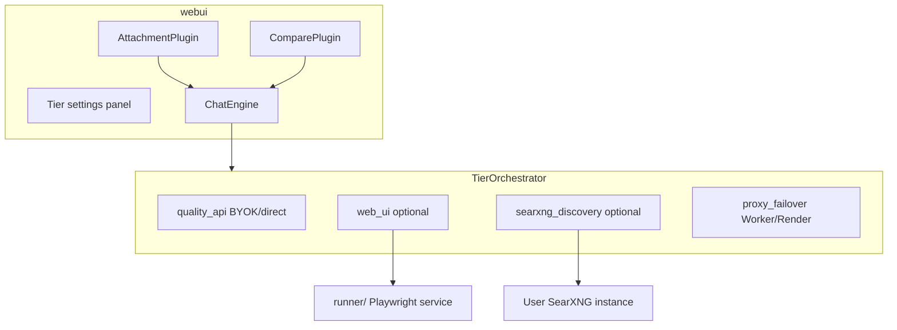
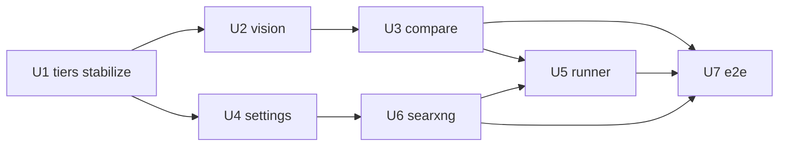

# feat: Chat UI Wave 4B — vision, compare, omnifail tiers

> **Origin:** [Wave 4B differentiation brainstorm](../brainstorms/2026-07-25-chat-ui-wave4b-differentiation-requirements.md) — vision attachments, two-column compare, user-ordered provider tiers including optional headless web-UI runner and SearXNG discovery.

### Delta Update

- **Landed (all units complete, 2026-07-25):** U1 orchestrator stabilized (disjoint tiers, Vitest storage shim, order-preserving `normalizeTierSettings`, structured R40 diagnostics); U2 vision attachments + multimodal mapper + vision guard; U4 Tiers settings panel; U3 compare mode; U6 SearXNG discovery tier + pick-list plugin; U5 opt-in `runner/` companion (stub + generic-selector adapters, Node ≥23.6 native TS) with `web-ui-tier.ts` browser bridge; U7 Playwright specs (`vision-attach`, `compare-mode`, `tier-settings`) registered in `deploy-pages.yml`, CAVEATS/plugins docs, CONCEPTS Wave 4B terms.
- **Verification:** webui vitest 68 passing; runner node:test 4 passing; Wave 4B Playwright specs green locally; `npm run build` green.
- **Commits:** a34dfce (U1) → da223b6 (U2) → 5622e91 (U4) → 6948748 (U3) → d57fa78 (U6) → 9262ecf (U5) → 52354ba (U7).

## Summary

Add **multimodal composer attachments**, **compare mode** (two sources, one prompt), and a **configurable provider-tier stack** with **disjoint route ownership**: `quality_api` (direct/BYOK) → optional headless web UI → SearXNG discovery → `proxy_failover` (Worker/Render endpoints). Zero-config demo enables quality_api + proxy_failover; exotic tiers stay opt-in. Exhaust user-enabled routes before giving up — still **best-effort** free-tier HA (STRATEGY), not “never fail.”

## Problem Frame

Waves 1–4 shipped table-stakes chat UX. Visitors still expect **image input** and **model shopping**. Configurable tiers deepen routing beyond today’s proxy→BYOK path. `messagesToOpenAi` still drops file blocks; compare UI and discovery/runner are not shipped. Partial U1 scaffold exists but must be corrected before feature units.

## Requirements traceability

| ID | Requirement |
|----|-------------|
| R28–R31 | Vision attach, non-vision guard, catalog filter, size cap |
| R32–R35 | Compare mode, column labels/chips, rate-limit warning, exit without history loss |
| R36–R41 | Ordered tiers, API/web/SearXNG tiers, diagnostics, local runner opt-in |
| R42–R43 | CAVEATS, graceful degradation |

## Key Technical Decisions

| ID | Decision | Rationale |
|----|----------|-----------|
| KTD1 | Register murm-ui `AttachmentPlugin` with image-only accept + 4MB cap (Q6 default: 1 image) | Reuse murm-ui file blocks; R31 client cap; plugin has no built-in max-count — enforce in handler |
| KTD2 | New `message-openai.ts` multimodal mapper (text + `image_url` data URLs) | Proxy/LiteLLM accept vision when model supports it |
| KTD3 | **`TierOrchestrator`** with injected handlers | R36–R40 without rewriting FailoverProvider in one pass |
| KTD4 | Compare = **`ComparePlugin`** with dual provider delegates, not second `ChatUI` | murm-ui single engine |
| KTD5 | **Web-UI tier** → user-configured **`runner/`** HTTP service | Static Pages cannot run Playwright; R38/R41 |
| KTD6 | **SearXNG tier** = browser fetch + **pick list** (Q5) | No Worker SearXNG required for v1 |
| KTD7 | **Disjoint tiers:** `quality_api` = direct/BYOK only; `proxy_failover` = configured proxy endpoints; **defaults enable both**; web_ui + searxng **disabled** | User choice: no duplicate proxy attempts; zero-config needs proxy enabled |
| KTD8 | Vision export/import text-only in Wave 4B | YAGNI; document in CAVEATS |
| KTD9 | Vitest: in-memory `localStorage` mock (or injectable storage seam) for tier tests — no full jsdom required | Unblocks U1; Node has no DOM |
| KTD10 | `normalizeTierSettings` **preserves user order**; only fills missing known tier IDs | Fixes R36/U4 reorder bug in current scaffold |
| KTD11 | Surface `TierOrchestratorError.attempts` via status strip / structured route error — do not squash to opaque string only | R40 diagnostics |
| KTD12 | Single storage key `providerTiers` JSON blob (`tiers`, `webRunnerUrl`, `searxngUrl`) | Matches landed code; plan no longer lists separate URL keys |
| KTD13 | Bootstrap stays `loadRuntimeConfig()` → `FailoverProvider`; never wire tiers to raw `readRuntimeConfig()` alone | AGENTS pitfall 14 / F001 |
| KTD14 | Compare does **not** depend on runner; API-tier compare ships before U5 | Visible demo win without companion process |

## High-Level Design

Disjoint ownership: `quality_api` never calls proxy endpoints; `proxy_failover` never runs BYOK browser routes. Missing config → `TierSkipError`, not a hard fail that aborts the chain early.

## Implementation Units

### U1. Provider tier model + orchestrator (R36–R40, R43) — stabilize WIP

**Goal:** Configurable ordered tiers with diagnostics; disjoint handlers; zero-config path unchanged.

**Requirements:** R36, R37, R40, R43

**Files:**
- `webui/src/providers/tiers/types.ts`
- `webui/src/providers/tiers/defaults.ts` — defaults: quality_api + proxy_failover **enabled**; order-preserving normalize
- `webui/src/providers/tiers/settings.ts`
- `webui/src/providers/tiers/orchestrator.ts`
- `webui/src/providers/tiers/orchestrator.test.ts` — localStorage mock; order + skip + diagnostics cases
- `webui/src/providers/FailoverProvider.ts` — split `streamQualityApiRoute` (BYOK/direct only) vs `streamProxyFailoverRoute` (proxy only); pass structured attempts on failure
- `webui/src/storage-keys.ts` — `providerTiers` only
- `webui/src/providers/FailoverProvider.tiers.test.ts` (new) — integration: zero-config hits proxy when BYOK absent

**Approach:**
1. Tier IDs: `quality_api`, `web_ui`, `searxng_discovery`, `proxy_failover`.
2. Persist ordered list + enabled flags in one localStorage JSON blob.
3. Orchestrator tries enabled tiers in stored order; collect `{ tier, error }[]`.
4. `quality_api` = browser-router / BYOK only; skip when no usable keys for selected model.
5. `proxy_failover` = dual-endpoint SSE loop only.
6. Fix Vitest storage before asserting behavior.

**Execution note:** Test-first — red tests for order preserve, disjoint ownership, and zero-config before green refactor.

**Test scenarios:**
- Default settings → quality_api skipped (no keys) then proxy_failover succeeds (mock) — same outcome as pre-refactor zero-config.
- Disabled web_ui → never calls runner URL.
- Custom tier order persisted after save/load (normalize must not reset to `TIER_IDS` catalog order).
- All tiers fail → `TierOrchestratorError.attempts` length ≥2 with tier ids.
- `TierSkipError` recorded; chain continues.
- AbortSignal mid-tier → error rethrown, no further tiers.

**Verification:** `cd webui && npm test` green including orchestrator suite.

---

### U2. Vision attachments + multimodal requests (R28–R31)

**Goal:** Image attach in composer; vision requests through enabled API/proxy tiers.

**Requirements:** R28, R29, R30, R31

**Dependencies:** U1

**Files:**
- `webui/src/main.ts` — register `AttachmentPlugin`
- `webui/src/providers/message-openai.ts` (new)
- `webui/src/providers/message-openai.test.ts` (new)
- `webui/src/providers/FailoverProvider.ts` — use mapper; vision guard before send
- `webui/src/plugins/model-picker/index.ts` — prefer `supports_vision` when attachments present
- `webui/shell/chat-overrides.css` — attachment tray; keep `data-theme` dark overrides intact

**Approach:**
1. AttachmentPlugin: `acceptedTypes: "image/*"`, `maxFileSize: 4_000_000`, max 1 file via handler.
2. Map `file` blocks → OpenAI `image_url` data URLs.
3. Guard: attachments && !vision-capable model → block with clear status (R29).
4. Suggest vision catalog models when image attached (R30).

**Test scenarios:**
- PNG block → OpenAI body contains `image_url`.
- Non-vision model + attachment → guard false / blocked send.
- Oversize file → clear error; session not corrupted.

**Verification:** vitest + mocked proxy path.

---

### U3. Compare mode UI (R32–R35)

**Goal:** Two-column compare with independent source per column (API/proxy tiers — no runner required).

**Requirements:** R32, R33, R34, R35

**Dependencies:** U1, U2

**Files:**
- `webui/src/plugins/compare-mode/index.ts` (new)
- `webui/src/plugins/compare-mode/column-provider.ts` (new)
- `webui/shell/chat-overrides.css` — `.lf-compare-grid`
- `webui/src/main.ts` — register plugin
- `tests/e2e/compare-mode.spec.ts` (new)

**Approach:**
1. Toggle compare; Q4 default: split-pane in `#chatMount`.
2. Each column: model + optional tier override (defaults to global order).
3. Fork prompt to two orchestrator/provider instances; grid rows for pairs.
4. Pre-send banner when both columns use metered routes (R34).
5. Exit compare restores single column; compare turns append as two assistant messages with column meta.

**Test scenarios:**
- Two mocked replies → both columns visible.
- Exit compare → history preserved.
- Rate-limit banner when compare enabled (mock).

**Verification:** Playwright compare-mode spec.

---

### U4. Tier settings panel (R36, R41, R42)

**Goal:** User configures tier order, SearXNG URL, web runner URL.

**Requirements:** R36, R41, R42

**Dependencies:** U1 (order-preserving settings)

**Files:**
- `webui/src/plugins/tier-settings/index.ts` (new)
- `webui/src/plugins/tier-settings/settings.test.ts` (new)
- `webui/src/shell-panels.ts`
- `docs/CAVEATS.md` — web automation + SearXNG ToS; disambiguate “provider tiers” (omnifail stack) vs cloud free-tier limits; bootstrap merge note (AGENTS pitfall 14); vision export text-only (KTD8)
- `docs/chat-ui-plugins.md`

**Approach:**
1. Shell panel: reorder + enable toggles.
2. Fields: SearXNG URL, web runner URL (empty default).
3. Copy: local runner opt-in (R41); ToS responsibility (R42); do not say “never fail.”

**Test scenarios:**
- Reorder → localStorage order → orchestrator attempt order matches.

**Verification:** vitest round-trip.

---

### U5. Local web-UI runner service (R38)

**Goal:** Minimal companion process for headless web chat automation tier.

**Requirements:** R38 (partial R40)

**Dependencies:** U1 (ships after U3 for sequencing preference)

**Files:**
- `runner/README.md` (new)
- `runner/package.json` (new)
- `runner/src/server.ts` (new)
- `runner/src/adapters/` (new) — stub + BYO selectors
- `webui/src/providers/tiers/web-ui-tier.ts` (new)

**Approach:**
1. OpenAI-shaped SSE; CORS for localhost + Pages.
2. Generic selector-driven adapter — not hardcoded ChatGPT.
3. Stub may return 501 until configured.

**Execution note:** Spike one adapter; stub acceptable for merge if documented.

**Test scenarios:**
- GET `/health`.
- Mock adapter fixed SSE text.

**Verification:** `cd runner && npm test`

---

### U6. SearXNG discovery tier (R39)

**Goal:** When higher tiers fail, search for candidate free chat URLs; show pick list.

**Requirements:** R39, R40

**Dependencies:** U1, U4

**Files:**
- `webui/src/providers/tiers/searxng-discovery-tier.ts` (new)
- `webui/src/providers/tiers/searxng-discovery-tier.test.ts` (new)
- `webui/src/plugins/discovery-picklist/index.ts` (new)

**Approach:**
1. Query user SearXNG JSON API with configurable query.
2. Heuristic filter; pick list (Q5); user confirms before feeding web runner.
3. Empty → explicit discovery-empty diagnostic (R40).

**Test scenarios:**
- Mock JSON → ≥1 URL.
- Empty → typed message.
- CORS failure → clear diagnostic (proxy spike deferred).

**Verification:** vitest fixtures.

---

### U7. E2E, docs, build (R28–R43)

**Goal:** CI coverage and operator docs.

**Requirements:** All

**Dependencies:** U2–U6 (U5 stub OK if documented)

**Files:**
- `tests/e2e/vision-attach.spec.ts` (new)
- `tests/e2e/compare-mode.spec.ts` (new)
- `tests/e2e/tier-settings.spec.ts` (new, optional)
- `.github/workflows/deploy-pages.yml` — register specs
- `docs/CAVEATS.md`, `docs/chat-ui-plugins.md`
- `CONCEPTS.md` — Wave 4B terms already present; do **not** re-add Wave 5–6 glossary rows in this unit

**Test scenarios:**
- Vision PNG + mocked vision model.
- Compare two mocked endpoints.
- Zero-config: web+searx disabled, text chat works; keep `MODEL_CHAIN` short on public Worker.

**Verification:** `cd webui && npm test && npm run build`; Playwright Wave 4B specs.

## Sequencing

**Recommended order:** U1 → U2 → U4 → U3 → U6 → U5 → U7

Compare before runner so the demo ships multimodal + side-by-side without requiring a companion process.

## Scope Boundaries

**In scope:** `webui/`, `runner/` companion, docs, Playwright mocks.

**Out of scope:** Worker-hosted Playwright, auto-login to third-party chats, 3+ compare columns, tool/reasoning UI (Wave 5), PWA, cloud sync.

### Deferred to Follow-Up Work

- Vision in export/import JSON
- Named-site runner adapters as optional plugins
- SearXNG CORS proxy on Worker if browser fetch blocked
- Wave 5 agent UX / Wave 6 transparency (queued plans/requirements)

## Risks and Dependencies

| Risk | Mitigation |
|------|------------|
| LiteLLM/proxy rejects large data URLs | Client resize + 4MB cap |
| Compare layout vs shell | CSS grid; disable on narrow viewports if needed |
| SearXNG CORS | Document CORS; optional runner proxy spike |
| Web automation ToS | Off by default; user-run; CAVEATS |
| Compare doubles rate limits | R34 pre-send warning |
| Losing murm-ui streaming patch on bump | See `docs/solutions/tooling-decisions/murm-ui-streaming-plaintext-tail-patch.md` |
| Stale single-endpoint localStorage | Always `loadRuntimeConfig()` after settings save |

## Acceptance Examples

- **AE1.** Attach PNG + vision model → assistant describes image via proxy.
- **AE2.** Compare `free` vs `openrouter/free` (mocked) → two columns, two replies.
- **AE3.** web_ui + searxng disabled → zero-config text chat matches pre-4B main.
- **AE4.** SearXNG configured, API/proxy fail mock → pick list with ≥1 URL or explicit empty.
- **AE5.** Reorder tiers in settings → next send attempts in new order; failure lists tiers tried.

## Open Questions (implementation-time)

| ID | Question | Plan default |
|----|----------|--------------|
| Q4 | Split-pane vs overlay | Split-pane in `#chatMount` |
| Q5 | Auto-queue vs pick list | Pick list |
| Q6 | Max images | 1 for v1 |
| Q7 | SearXNG CORS | Direct fetch first; runner proxy if blocked |
| Q8 | Vitest storage | In-memory localStorage mock in test file / tiny helper |

## Sources

- [Wave 4B requirements](../brainstorms/2026-07-25-chat-ui-wave4b-differentiation-requirements.md)
- [STRATEGY.md](../../STRATEGY.md) — best-effort HA; optional companions; no agent-gateway identity
- murm-ui `AttachmentPlugin` — `webui/node_modules/murm-ui/dist/plugins/attachment/`
- WIP scaffold — `webui/src/providers/tiers/`, `webui/src/providers/FailoverProvider.ts`
- Learnings — `docs/solutions/integration-issues/workers-ai-proxy-fallback-and-model-chain.md`, `docs/solutions/tooling-decisions/murm-ui-streaming-plaintext-tail-patch.md`
