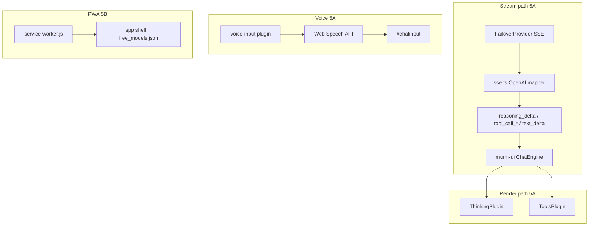
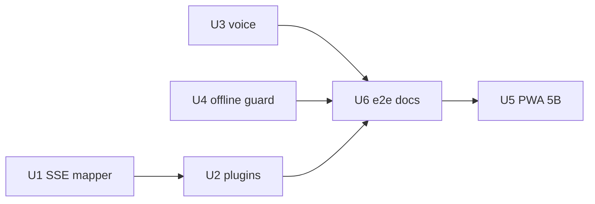

# feat: Chat UI Wave 5 — agent UX trust layer

> **Origin:** [Wave 5 agent UX brainstorm](../brainstorms/2026-07-25-chat-ui-wave5-agent-ux-requirements.md) — reasoning blocks, tool-call cards, voice input, optional PWA (5B). **Prerequisite:** Wave 4B merged to `main` before **implementation** starts (planning already complete).

## Summary

Wire **murm-ui's built-in thinking and tools plugins**, extend **FailoverProvider SSE mapping** so reasoning and tool-call stream events reach the renderer, add **composer voice dictation** (Web Speech API), and optionally ship **PWA shell + offline read** as Wave **5B**.

## Problem Frame

murm-ui already handles `reasoning_delta` and `tool_call_*` events and ships `ThinkingPlugin` + `ToolsPlugin`, but the bundled default renderer skips reasoning and shows tool calls as a one-line placeholder. `webui/src/providers/sse.ts` forwards **text only**. Voice chrome exists in ResearchWizard CSS but is hidden by Wave 1 R18 overrides.

## Requirements (Wave 5 traceability)

| ID | Source | Wave 5 requirement |
|----|--------|-------------------|
| R44 | Wave 5 | Collapsed thinking header with expand/collapse when reasoning streams |
| R45 | Wave 5 | No reasoning UI when provider omits channel |
| R46 | Wave 5 | Final answer visually primary; reasoning muted |
| R47 | Wave 5 | Tool lifecycle cards replace emoji placeholder |
| R48 | Wave 5 | Display-only — no tool execution loop |
| R49 | Wave 5 | Tool name, status, expandable args summary |
| R50 | Wave 5 | Mic → Web Speech → composer on supported browsers |
| R51 | Wave 5 | Disabled mic + tooltip on unsupported browsers |
| R52 | Wave 5 | Manual send after dictation |
| R53 | Wave 5 | Service worker caches shell + catalog (5B) |
| R54 | Wave 5 | Offline read sessions; block send with message (5B) |
| R55 | Wave 5 | SW update reload prompt (5B) |
| R56 | Wave 5 | Text-only routes unchanged |
| R57 | Wave 5 | No new Worker endpoints for voice/PWA |

**Out of scope:** MCP client, tool execution loop, TTS, generative UI widgets (see origin doc).

## Key Technical Decisions

| ID | Decision | Rationale |
|----|----------|-----------|
| KTD1 | **Reuse murm-ui `ThinkingPlugin` + `ToolsPlugin`** | Already match R44–R49; import via `murm-ui/plugins/thinking` and `murm-ui/plugins/tools` (see origin K9–K10) |
| KTD2 | **Port OpenAI stream mapping from murm-ui `OpenAIProvider`** into `webui/src/providers/sse.ts` (or shared helper) | Reasoning fields (`reasoning_content`, `reasoning`, `reasoning_text`) and `delta.tool_calls` handling already implemented upstream — avoid reinventing (see origin dependency note) |
| KTD3 | **Duration label v1: accept murm-ui "Thought Process" / "Thinking…"** | murm-ui toggle does not emit elapsed seconds; "Thought for Ns" deferred to follow-up unless trivial timer added in thin wrapper plugin |
| KTD4 | **Voice via first-party `voice-input` plugin** | Inject mic into `.mur-form-footer-right`; remove `#voiceInputBtn` from hide list in `chat-overrides.css`; do not port legacy TTS from `docs/legacy/chatgpt-web/` |
| KTD5 | **5A and 5B as separate PRs** | Origin Q9 default — agent UX ships first; PWA adds build/CI surface |
| KTD6 | **Branch from `main` after Wave 4B merge** | Avoid parallel diffs on `FailoverProvider` / composer |
| KTD7 | **Validate reasoning/tools on mocked SSE + BYOK path** | Free proxy may not emit reasoning today; e2e uses fixture streams |

## High-Level Technical Design

## Implementation Units

### U1. OpenAI SSE mapper — reasoning + tool events (R44–R49, R56)

**Goal:** `emitOpenAiSseAsStreamEvents` emits the same event types murm-ui's `OpenAIProvider` emits for reasoning and tool calls.

**Requirements:** R44–R49, R56

**Dependencies:** None (Wave 4B merged on branch)

**Files:**
- `webui/src/providers/sse.ts` — extend delta handling
- `webui/src/providers/openai-stream-mapper.ts` (new, optional extract) — mirror murm-ui reasoning/tool logic for testability
- `webui/src/providers/sse.test.ts` (new)

**Approach:**
1. Add reasoning extraction for `reasoning_content`, `reasoning`, `reasoning_text`, encrypted variants (match murm-ui `extractReasoning`).
2. Track `currentReasoningBlockId`, `activeToolCalls` map by index; emit `reasoning_delta`, `tool_call_start`, `tool_call_delta`.
3. On `finish_reason: tool_calls`, emit `finish` with `tool_use` (existing).
4. Mark tool blocks `complete` on stream end if murm-ui reducer expects it — verify against `stream-reducer.js` (may need `tool_call_delta` with `status: "complete"` on finish).
5. Text-only chunks behave exactly as today.

**Patterns to follow:** `webui/node_modules/murm-ui/dist/core/providers/openai.js` (reference only — copy logic into first-party module, do not import from node_modules at runtime).

**Test scenarios:**
- Chunk with `delta.reasoning_content` → `reasoning_delta` with blockId.
- Chunk with `delta.content` only → `text_delta` only; no reasoning events.
- First `tool_calls` chunk with `id` → `tool_call_start`; follow-up chunks → `tool_call_delta` with args append.
- `[DONE]` after mixed stream → single `finish`.
- Malformed JSON line → ignored (existing behavior).

**Verification:** `cd webui && npm test` — `sse.test.ts` passes; manual BYOK stream with reasoning model optional.

---

### U2. Register thinking + tools plugins (R44–R49, R46)

**Goal:** Reasoning and tool blocks render via murm-ui plugins instead of default placeholder/skip.

**Requirements:** R44–R49, R46

**Dependencies:** U1

**Files:**
- `webui/src/main.ts` — register plugins in `plugins:` array **before** message rendering order matters (thinking/tools early in list)
- `webui/shell/chat-overrides.css` — optional dark-theme tweaks for `.mur-think-wrapper`, `.mur-tool-summary` on embedded shell

**Approach:**
1. `import { ThinkingPlugin } from "murm-ui/plugins/thinking"` and `ToolsPlugin` from `murm-ui/plugins/tools` (CSS loads via sideEffects).
2. Register `ThinkingPlugin()` and `ToolsPlugin({ defaultExpanded: false })`.
3. Confirm text blocks still render via default path when no reasoning/tools present (R56 regression).
4. Optional: add `lf-think-muted` override so reasoning sits visually subordinate to answer (R46).

**Patterns to follow:** Existing plugin registration in `webui/src/main.ts` (`CopyPlugin`, `RoutingChipPlugin`).

**Test scenarios:**
- Engine state with `reasoning` block → plugin renders toggle (manual or e2e in U5).
- Engine state with `tool_call` block status `streaming` → card shows `...` status symbol per ToolsPlugin.

**Verification:** Manual chat with mocked provider emitting reasoning/tool events; zero-config text chat unchanged.

---

### U3. Voice input plugin (R50–R52, R51)

**Goal:** Mic button dictating into composer on Chromium; graceful degrade elsewhere.

**Requirements:** R50–R52, R51, R57

**Dependencies:** None (parallel with U1–U2)

**Files:**
- `webui/src/plugins/voice-input/index.ts` (new)
- `webui/src/plugins/voice-input/speech.ts` (new) — feature detect, `SpeechRecognition` / `webkitSpeechRecognition`
- `webui/src/plugins/voice-input/speech.test.ts` (new)
- `webui/shell/chat-overrides.css` — remove `#voiceInputBtn` from hide rule; add `.lf-voice-btn` styles aligned with shell
- `webui/src/main.ts` — register `VoiceInputPlugin()`

**Approach:**
1. On `onMount`, locate `.mur-form-footer-right` and insert mic button before send.
2. If `SpeechRecognition` unavailable: render disabled button with `title` explaining browser limitation (R51).
3. On click: toggle listening; append/interim-update `#chatinput` value; visual `.listening` state (reuse shell CSS patterns).
4. Do **not** auto-submit on `onend` (R52).
5. Handle permission denied with status-strip toast.

**Patterns to follow:** Interim results pattern from `docs/legacy/chatgpt-web/` (reference only); `ShortcutsSheetPlugin` for modal/toast patterns.

**Test scenarios:**
- Mock `SpeechRecognition` → transcript appended to textarea value.
- No API → button disabled, `title` contains "not supported".
- `onend` fires → form not submitted.

**Verification:** Manual on Chrome; vitest for feature-detect helpers.

---

### U4. Offline send guard (R54 partial, prep for 5B)

**Goal:** When `navigator.onLine === false`, block send with clear copy even before SW lands (cheap win for 5B).

**Requirements:** R54 (message half)

**Dependencies:** None

**Files:**
- `webui/src/plugins/offline-guard/index.ts` (new) or hook in `VoiceInputPlugin`'s sibling
- `webui/src/main.ts` — register plugin

**Approach:**
1. Listen to `online` / `offline` events.
2. Disable send button + show banner in status strip or above composer when offline.
3. IndexedDB sessions remain readable (murm-ui default — no change).

**Test scenarios:**
- Fire `offline` event → send disabled, message visible.
- Fire `online` → send re-enabled.

**Verification:** Manual devtools offline; optional vitest event dispatch.

---

### U5. Service worker + cache (R53, R55) — Wave 5B

**Goal:** Repeat visits load cached shell; updates prompt reload.

**Requirements:** R53, R55

**Dependencies:** U1–U4 merged (5A)

**Files:**
- `webui/public/sw.js` or `webui/src/sw.ts` (new) — compiled/copied to `docs/sw.js`
- `webui/esbuild.config.mjs` — copy SW to `docs/`
- `webui/src/pwa/register.ts` (new) — register SW, listen for `controllerchange` / updatefound
- `webui/src/main.ts` — call register on bootstrap
- `docs/manifest.json` — verify `start_url`, icons (existing)

**Approach:**
1. Cache-first for `./assets/**`, `./assets/shell/**`, `./config.js`, `./free_models.json` with versioned cache name (`lf-cache-v${APP_VERSION}`).
2. Network-first for chat API (N/A — client calls external proxy; no change).
3. On waiting worker → non-blocking toast "Update available — Reload" (R55).
4. Do not cache `/v1/chat/completions` or proxy URLs.

**Patterns to follow:** MDN PWA offline guide (origin research); version bump via existing `APP_VERSION` in CI.

**Test scenarios:**
- Second load serves shell from SW (manual Application tab).
- New SW waiting → reload prompt appears.

**Verification:** Manual; document in `docs/chat-ui-plugins.md`.

---

### U6. E2E, docs, build (R44–R57)

**Goal:** CI coverage and operator docs for Wave 5A (+ 5B when included).

**Requirements:** All applicable

**Dependencies:** U1–U5 (U5 only if shipping 5B in same release cycle)

**Files:**
- `tests/e2e/reasoning-block.spec.ts` (new) — mock SSE with reasoning chunks
- `tests/e2e/tool-call-card.spec.ts` (new) — mock SSE with tool_calls
- `tests/e2e/voice-input.spec.ts` (new) — disabled state or mocked recognition
- `docs/chat-ui-plugins.md` — document thinking, tools, voice, PWA
- `.github/workflows/deploy-pages.yml` — add e2e specs if stable

**Test scenarios:**
- Mock stream with reasoning → `.mur-think-toggle` visible in assistant message.
- Mock stream with tool_calls → `.mur-tool-summary` visible (not emoji placeholder).
- Zero-config text reply → no thinking/tool chrome (regression via existing `pages-chat-zero-config.spec.ts`).
- Voice: mic present; on Playwright default (Chromium) optionally skip live mic.

**Verification:** `cd webui && npm test && npm run build`; Playwright wave 5 specs.

---

## Sequencing

**Recommended order (5A):** U1 → U2 → U3 → U4 → U6

**5B follow-on:** U5 after 5A merges (can reuse U4 offline guard).

## Scope Boundaries

**In scope:** `webui/`, `tests/e2e/`, `docs/chat-ui-plugins.md`, `docs/sw.js` (5B).

**Out of scope:** Tool execution, MCP panel, TTS, Worker changes.

### Deferred to Follow-Up Work

- "Thought for Ns" elapsed timer (KTD3)
- Tool execution loop + `tool_result` round-trip
- Background Sync offline send queue
- SearXNG / tier work (Wave 4B plan)

**Outside product identity:** MCP marketplace, Open WebUI embedding (STRATEGY).

## Risks and Dependencies

| Risk | Mitigation |
|------|------------|
| Free proxy never emits reasoning | Document BYOK/demo path; e2e uses mocks |
| murm-ui plugin CSS clashes with shell | `chat-overrides.css` spot fixes |
| Web Speech blocked or denied | R51 disabled state + toast |
| SW breaks cache busting | Version cache key from `APP_VERSION`; skip caching `chat.js` with query param or use stale-while-revalidate |
| Wave 4B not merged | KTD6 — rebase after 4B |

## Acceptance Examples

- **AE1.** Mocked reasoning stream → collapsed thinking toggle expands to show trace; answer text visible below.
- **AE2.** Mocked tool stream → lifecycle card with name and status; expand shows args JSON.
- **AE3.** Chrome → mic fills composer; user clicks send manually.
- **AE4.** Safari → mic disabled with tooltip (or skip if e2e uses unsupported flag).
- **AE5.** Zero-config text chat on homepage → identical to pre-Wave-5 behavior.
- **AE6.** (5B) Offline → prior messages readable; send blocked with message.

## Sources and Research

- Origin: `docs/brainstorms/2026-07-25-chat-ui-wave5-agent-ux-requirements.md`
- murm-ui reference: `OpenAIProvider` stream mapping, `ThinkingPlugin`, `ToolsPlugin` (v0.2.0)
- Prior voice UX: `docs/legacy/chatgpt-web/` (STT patterns only)
- [TanStack AI thinking content](https://tanstack.com/ai/latest/docs/chat/thinking-content)
- [MDN PWA offline guide](https://developer.mozilla.org/en-US/docs/Web/Progressive_web_apps/Guides/Offline_and_background_operation)
